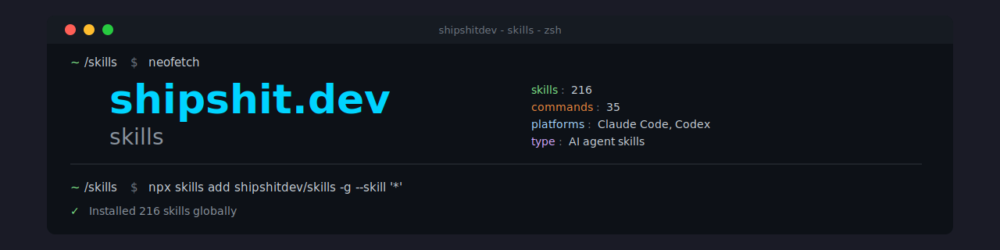

# Ship Shit Dev Library


250+ AI agent skills for indie developers. Works with Claude Code, OpenAI Codex, and Cursor.

## Directory Structure

```
library/
├── skills/              # All skills (252 skills)
├── commands/            # All commands (35 commands)
├── bundles/             # Generated marketplace bundles
├── .agents/              # Library management (sessions, tasks)
│   └── SYSTEM/          # Library documentation
└── scripts/             # Scaffolding, validation scripts
```

## What's Included

- **Skills**: Specialized agent capabilities for specific domains (e.g., `stripe-implementer`, `mongodb-migration-expert`)
- **Commands**: Workflow commands for structured tasks (e.g., `code-review`, `deploy`, `mvp-plan`)
- **Documentation**: Platform-specific adaptations and management guides
- **Scripts**: Tooling for syncing, validation, and generation

## Installation

### Quick Install (Recommended)

```bash
# Install all skills globally — pick your agents
npx skills add shipshitdev/skills -g --agent claude-code cursor codex openclaw --skill '*' -y

# Install specific skills
npx skills add shipshitdev/skills -g --skill stripe-implementer -y

# List available skills
npx skills add shipshitdev/skills --list
```

> **Do NOT use `--all`** — it installs to every agent the CLI knows about (30+).
> Always use `--agent` to target only the agents you use.

### Project-local Install

```bash
npx skills add shipshitdev/skills --agent claude-code cursor
```

### Claude Code Plugin (Alternative)

```bash
/plugin marketplace add shipshitdev/skills
/plugin install shipshitdev-startup@shipshitdev    # or any category bundle
```

### For Contributors

Clone the repo and use the CLI to install:

```bash
git clone https://github.com/shipshitdev/skills.git ~/shipshitdev-library
cd ~/shipshitdev-library
npx skills add . -g --agent claude-code cursor codex openclaw --skill '*' -y
```

After making changes, reinstall to update:

```bash
npx skills add shipshitdev/skills -g --agent claude-code cursor codex openclaw --skill '*' -y
```

## Adding Skills & Commands

### Adding a Skill

1. Create directory in `skills/skill-name/`
2. Add `SKILL.md` with YAML frontmatter
3. Update this README

```bash
mkdir -p skills/my-skill
touch skills/my-skill/SKILL.md
```

### Adding a Command

1. Create `.md` file in `commands/`
2. Follow naming: `{verb}-{noun}.md`
3. Update this README

## Documentation

- `.agents/SYSTEM/ARCHITECTURE.md` - .agent folder structure explained
- `.agents/SYSTEM/AI-DEV-LOOP.md` - The /loop autonomous workflow
- `.agents/SYSTEM/PLATFORM-ADAPTATIONS.md` - Claude vs Codex vs Cursor differences
- `.agents/SYSTEM/SKILL-MANAGEMENT.md` - Syncing skills across platforms

## Commands

| Command          | Description                                    | Cursor                                                      |
|------------------|------------------------------------------------|-------------------------------------------------------------|
| analyze-codebase | Codebase analysis                               | [analyze-codebase](commands/analyze-codebase.md) |
| api-test         | API test generation                            | [api-test](commands/api-test.md)             |
| bug              | Bug capture workflow                            | [bug](commands/bug.md)                       |
| check-domain     | Domain name generator & availability checker   | [check-domain](commands/check-domain.md)       |
| clean            | Cleanup workflow                                | [clean](commands/clean.md)                     |
| code-review      | Code review                                     | [code-review](commands/code-review.md)        |
| db-setup         | MongoDB/Redis setup                             | [db-setup](commands/db-setup.md)              |
| de-slop          | Clean AI code artifacts                         | [de-slop](commands/de-slop.md)                |
| deploy           | Deployment workflows                            | [deploy](commands/deploy.md)                   |
| docs-generate    | Documentation generation                        | [docs-generate](commands/docs-generate.md)     |
| docs-update      | Documentation updates                           | [docs-update](commands/docs-update.md)        |
| end              | End session                                     | [end](commands/end.md)                         |
| env-setup        | Environment variables                           | [env-setup](commands/env-setup.md)            |
| inbox            | Process inbox items                             | [inbox](commands/inbox.md)                     |
| launch           | Launch workflow                                 | [launch](commands/launch.md)                    |
| migrate          | Database migrations                             | [migrate](commands/migrate.md)                 |
| monitoring-setup| Sentry/Analytics setup                         | [monitoring-setup](commands/monitoring-setup.md) |
| mvp-plan         | MVP planning                                    | [mvp-plan](commands/mvp-plan.md)               |
| new-cmd          | Create new commands                             | [new-cmd](commands/new-cmd.md)                 |
| new-session      | Create session files                            | [new-session](commands/new-session.md)         |
| optimize-prompt  | Prompt optimization                             | [optimize-prompt](commands/optimize-prompt.md)  |
| performance      | Performance analysis                            | [performance](commands/performance.md)           |
| quick-fix        | Quick fixes                                     | [quick-fix](commands/quick-fix.md)              |
| refactor-code    | Code refactoring                                | [refactor-code](commands/refactor-code.md)     |
| review-pr        | PR review                                       | [review-pr](commands/review-pr.md)              |
| scaffold         | Project scaffolding                             | [scaffold](commands/scaffold.md)                |
| security-audit   | Security audit                                  | [security-audit](commands/security-audit.md)   |
| start            | Start session                                   | [start](commands/start.md)                      |
| task             | Task management                                 | [task](commands/task.md)                         |
| test             | Test tracking                                   | [test](commands/test.md)                        |
| validate         | Validation workflow                             | [validate](commands/validate.md)                 |

## Skills

| Skill | Description | Install |
|-------|-------------|---------|
| [ab-test-setup](https://skills.sh/shipshitdev/skills/ab-test-setup) | When the user wants to plan, design, or implement an A/B test or experiment | `npx skills add shipshitdev/skills --skill ab-test-setup` |
| [accessibility](https://skills.sh/shipshitdev/skills/accessibility) | Expert in web accessibility (WCAG 2.1 AA compliance) for React/Next.js appl | `npx skills add shipshitdev/skills --skill accessibility` |
| [advanced-evaluation](https://skills.sh/shipshitdev/skills/advanced-evaluation) | Master LLM-as-a-Judge evaluation techniques including direct scoring, pairw | `npx skills add shipshitdev/skills --skill advanced-evaluation` |
| [agent-browser](https://skills.sh/shipshitdev/skills/agent-browser) | Automates browser interactions for web testing, form filling, screenshots, | `npx skills add shipshitdev/skills --skill agent-browser` |
| [agent-config-audit](https://skills.sh/shipshitdev/skills/agent-config-audit) | Audit and sync AI agent configuration files (CLAUDE.md, CODEX.md, AGENTS.md | `npx skills add shipshitdev/skills --skill agent-config-audit` |
| [agent-folder-init](https://skills.sh/shipshitdev/skills/agent-folder-init) | Initialize a comprehensive .agents/ folder structure for AI-first developme | `npx skills add shipshitdev/skills --skill agent-folder-init` |
| [ai-dev-loop](https://skills.sh/shipshitdev/skills/ai-dev-loop) | Orchestrate autonomous AI development with task-based workflow and QA gates | `npx skills add shipshitdev/skills --skill ai-dev-loop` |
| [ai-loading-ux](https://skills.sh/shipshitdev/skills/ai-loading-ux) | Design AI loading, thinking, and progress indicator UX. Use when explicitly | `npx skills add shipshitdev/skills --skill ai-loading-ux` |
| [analytics-expert](https://skills.sh/shipshitdev/skills/analytics-expert) | This skill should be used when users need help analyzing content analytics | `npx skills add shipshitdev/skills --skill analytics-expert` |
| [analyze-codebase](https://skills.sh/shipshitdev/skills/analyze-codebase) | Generate comprehensive codebase analysis covering architecture, security, p | `npx skills add shipshitdev/skills --skill analyze-codebase` |
| [api-design-expert](https://skills.sh/shipshitdev/skills/api-design-expert) | Expert in RESTful API design, OpenAPI/Swagger documentation, versioning, er | `npx skills add shipshitdev/skills --skill api-design-expert` |
| [api-security-best-practices](https://skills.sh/shipshitdev/skills/api-security-best-practices) | Implement secure API design: authentication (JWT, OAuth 2.0, API keys), aut | `npx skills add shipshitdev/skills --skill api-security-best-practices` |
| [artifacts-builder](https://skills.sh/shipshitdev/skills/artifacts-builder) | Suite of tools for creating elaborate, multi-component claude.ai HTML artif | `npx skills add shipshitdev/skills --skill artifacts-builder` |
| [ask-questions-if-underspecified](https://skills.sh/shipshitdev/skills/ask-questions-if-underspecified) | Pause and clarify underspecified requirements before implementing. Use when | `npx skills add shipshitdev/skills --skill ask-questions-if-underspecified` |
| [audit](https://skills.sh/shipshitdev/skills/audit) | Run technical quality checks across accessibility, performance, theming, re | `npx skills add shipshitdev/skills --skill audit` |
| [aws-infrastructure](https://skills.sh/shipshitdev/skills/aws-infrastructure) | Expert in AWS infrastructure setup including EC2, VPC, security groups, App | `npx skills add shipshitdev/skills --skill aws-infrastructure` |
| [backend-security-coder](https://skills.sh/shipshitdev/skills/backend-security-coder) | Expert in secure backend coding: input validation, authentication, injectio | `npx skills add shipshitdev/skills --skill backend-security-coder` |
| [biome-validator](https://skills.sh/shipshitdev/skills/biome-validator) | Validate Biome 2.3+ configuration and detect outdated patterns. Ensures pro | `npx skills add shipshitdev/skills --skill biome-validator` |
| [brand-architect](https://skills.sh/shipshitdev/skills/brand-architect) | Use this skill when users need to develop brand strategy, choose a company | `npx skills add shipshitdev/skills --skill brand-architect` |
| [brand-name-generator](https://skills.sh/shipshitdev/skills/brand-name-generator) | Generate creative brand names, company names, product names, or startup nam | `npx skills add shipshitdev/skills --skill brand-name-generator` |
| [bun-development](https://skills.sh/shipshitdev/skills/bun-development) | Fast, modern JavaScript/TypeScript development with the Bun runtime. Covers | `npx skills add shipshitdev/skills --skill bun-development` |
| [bun-validator](https://skills.sh/shipshitdev/skills/bun-validator) | Validate Bun workspace configuration and detect common monorepo issues. Ens | `npx skills add shipshitdev/skills --skill bun-validator` |
| [business-model-auditor](https://skills.sh/shipshitdev/skills/business-model-auditor) | Use this skill when users need to stress test their business model, identif | `npx skills add shipshitdev/skills --skill business-model-auditor` |
| [business-operator](https://skills.sh/shipshitdev/skills/business-operator) | Use this skill when users manage multiple businesses, need help prioritizin | `npx skills add shipshitdev/skills --skill business-operator` |
| [changelog-generator](https://skills.sh/shipshitdev/skills/changelog-generator) | Automatically creates user-facing changelogs from git commits by analyzing | `npx skills add shipshitdev/skills --skill changelog-generator` |
| [channel-validator](https://skills.sh/shipshitdev/skills/channel-validator) | Use this skill when users need to validate their marketing channel strategy | `npx skills add shipshitdev/skills --skill channel-validator` |
| [churn-prevention](https://skills.sh/shipshitdev/skills/churn-prevention) | Reduce voluntary and involuntary churn with cancel flows, dynamic save offe | `npx skills add shipshitdev/skills --skill churn-prevention` |
| [clarify](https://skills.sh/shipshitdev/skills/clarify) | Improve unclear UX copy, error messages, microcopy, labels, and instruction | `npx skills add shipshitdev/skills --skill clarify` |
| [claude-code-guide](https://skills.sh/shipshitdev/skills/claude-code-guide) | To provide a comprehensive reference for configuring and using Claude Code | `npx skills add shipshitdev/skills --skill claude-code-guide` |
| [clean-code](https://skills.sh/shipshitdev/skills/clean-code) | Improve readability, cohesion, naming, and maintainability without changing | `npx skills add shipshitdev/skills --skill clean-code` |
| [clerk-validator](https://skills.sh/shipshitdev/skills/clerk-validator) | Validate Clerk authentication configuration and detect deprecated patterns. | `npx skills add shipshitdev/skills --skill clerk-validator` |
| [code-refactoring-refactor-clean](https://skills.sh/shipshitdev/skills/code-refactoring-refactor-clean) | You are a code refactoring expert specializing in clean code principles, SO | `npx skills add shipshitdev/skills --skill code-refactoring-refactor-clean` |
| [code-review](https://skills.sh/shipshitdev/skills/code-review) | Comprehensive code review focusing on quality, security, performance, and t | `npx skills add shipshitdev/skills --skill code-review` |
| [cofounder-evaluator](https://skills.sh/shipshitdev/skills/cofounder-evaluator) | Use this skill when users need to evaluate potential co-founders, assess fo | `npx skills add shipshitdev/skills --skill cofounder-evaluator` |
| [cold-email](https://skills.sh/shipshitdev/skills/cold-email) | Write B2B cold emails and follow-up sequences that earn replies. Use when c | `npx skills add shipshitdev/skills --skill cold-email` |
| [comment-mode](https://skills.sh/shipshitdev/skills/comment-mode) | Granular feedback on drafts without rewriting. Generates highlighted HTML w | `npx skills add shipshitdev/skills --skill comment-mode` |
| [commit-summary](https://skills.sh/shipshitdev/skills/commit-summary) | Generate meaningful commit messages from staged changes using conventional | `npx skills add shipshitdev/skills --skill commit-summary` |
| [competitive-intelligence-analyst](https://skills.sh/shipshitdev/skills/competitive-intelligence-analyst) | Use this skill when users need to analyze competitors, monitor market movem | `npx skills add shipshitdev/skills --skill competitive-intelligence-analyst` |
| [component-library](https://skills.sh/shipshitdev/skills/component-library) | Expert React/Next.js component architect specializing in creating consisten | `npx skills add shipshitdev/skills --skill component-library` |
| [constraint-eliminator](https://skills.sh/shipshitdev/skills/constraint-eliminator) | Use this skill when users need to remove customer friction, improve custome | `npx skills add shipshitdev/skills --skill constraint-eliminator` |
| [content-creator](https://skills.sh/shipshitdev/skills/content-creator) | Expert content creator specializing in newsletters and tweets that capture | `npx skills add shipshitdev/skills --skill content-creator` |
| [content-script-developer](https://skills.sh/shipshitdev/skills/content-script-developer) | Expert in browser extension content scripts, DOM integration, and safe page | `npx skills add shipshitdev/skills --skill content-script-developer` |
| [content-strategy](https://skills.sh/shipshitdev/skills/content-strategy) | Plan a content strategy, topic clusters, editorial roadmap, and content mix | `npx skills add shipshitdev/skills --skill content-strategy` |
| [context-degradation](https://skills.sh/shipshitdev/skills/context-degradation) | Recognize, diagnose, and mitigate patterns of context degradation in agent | `npx skills add shipshitdev/skills --skill context-degradation` |
| [context-fundamentals](https://skills.sh/shipshitdev/skills/context-fundamentals) | Understand the components, mechanics, and constraints of context in agent s | `npx skills add shipshitdev/skills --skill context-fundamentals` |
| [context-optimization](https://skills.sh/shipshitdev/skills/context-optimization) | Apply optimization techniques to extend effective context capacity. Use whe | `npx skills add shipshitdev/skills --skill context-optimization` |
| [copy-validator](https://skills.sh/shipshitdev/skills/copy-validator) | Use this skill when users need to validate sales copy, landing page text, e | `npx skills add shipshitdev/skills --skill copy-validator` |
| [copywriter](https://skills.sh/shipshitdev/skills/copywriter) | Brand voice guardian and conversion-focused copywriter, specializing in dir | `npx skills add shipshitdev/skills --skill copywriter` |
| [copywriting](https://skills.sh/shipshitdev/skills/copywriting) | Write rigorous, conversion-focused marketing copy for landing pages and ema | `npx skills add shipshitdev/skills --skill copywriting` |
| [critique](https://skills.sh/shipshitdev/skills/critique) | Evaluate design from a UX perspective, assessing visual hierarchy, informat | `npx skills add shipshitdev/skills --skill critique` |
| [cto-advisor](https://skills.sh/shipshitdev/skills/cto-advisor) | Technical leadership guidance for engineering teams, architecture decisions | `npx skills add shipshitdev/skills --skill cto-advisor` |
| [de-slop](https://skills.sh/shipshitdev/skills/de-slop) | Remove AI-generated code artifacts (console.log, any types, unused imports, | `npx skills add shipshitdev/skills --skill de-slop` |
| [debug](https://skills.sh/shipshitdev/skills/debug) | Comprehensive debugging methodology for finding and fixing bugs (formerly d | `npx skills add shipshitdev/skills --skill debug` |
| [deploy](https://skills.sh/shipshitdev/skills/deploy) | Run deployment workflows for web applications (staging, production). Use wh | `npx skills add shipshitdev/skills --skill deploy` |
| [design-consistency-auditor](https://skills.sh/shipshitdev/skills/design-consistency-auditor) | Audit and maintain design system consistency, UX/UI patterns, color palette | `npx skills add shipshitdev/skills --skill design-consistency-auditor` |
| [devcontainer-setup](https://skills.sh/shipshitdev/skills/devcontainer-setup) | Set up a .devcontainer for VS Code with Docker, Claude Code CLI support, an | `npx skills add shipshitdev/skills --skill devcontainer-setup` |
| [differential-review](https://skills.sh/shipshitdev/skills/differential-review) | Performs security-focused differential review of code changes (PRs, commits | `npx skills add shipshitdev/skills --skill differential-review` |
| [docker-expert](https://skills.sh/shipshitdev/skills/docker-expert) | Expert in Docker, docker-compose, Dockerfile patterns, and container orches | `npx skills add shipshitdev/skills --skill docker-expert` |
| [docs](https://skills.sh/shipshitdev/skills/docs) | Creates clear, concise technical documentation for software projects, runbo | `npx skills add shipshitdev/skills --skill docs` |
| [early-hiring-advisor](https://skills.sh/shipshitdev/skills/early-hiring-advisor) | Use this skill when users need to make early hires, build their founding te | `npx skills add shipshitdev/skills --skill early-hiring-advisor` |
| [ec2-backend-deployer](https://skills.sh/shipshitdev/skills/ec2-backend-deployer) | Expert in deploying backends to EC2 instances using CI/CD pipelines, Docker | `npx skills add shipshitdev/skills --skill ec2-backend-deployer` |
| [email-finder](https://skills.sh/shipshitdev/skills/email-finder) | This skill should be used when users need to find email addresses associate | `npx skills add shipshitdev/skills --skill email-finder` |
| [email-sequence](https://skills.sh/shipshitdev/skills/email-sequence) | When the user wants to create or optimize an email sequence, drip campaign, | `npx skills add shipshitdev/skills --skill email-sequence` |
| [error-handling-expert](https://skills.sh/shipshitdev/skills/error-handling-expert) | Expert in error handling patterns, exception management, error responses, l | `npx skills add shipshitdev/skills --skill error-handling-expert` |
| [evaluation](https://skills.sh/shipshitdev/skills/evaluation) | Build evaluation frameworks for agent systems. Use when testing agent perfo | `npx skills add shipshitdev/skills --skill evaluation` |
| [execution-accelerator](https://skills.sh/shipshitdev/skills/execution-accelerator) | Use this skill when users are stuck on a decision, overthinking, experienci | `npx skills add shipshitdev/skills --skill execution-accelerator` |
| [execution-validator](https://skills.sh/shipshitdev/skills/execution-validator) | Use this skill when users need to validate a launch plan, assess MVP scope, | `npx skills add shipshitdev/skills --skill execution-validator` |
| [expert-architect](https://skills.sh/shipshitdev/skills/expert-architect) | Use this skill when users need to build their positioning, develop their at | `npx skills add shipshitdev/skills --skill expert-architect` |
| [expert-validator](https://skills.sh/shipshitdev/skills/expert-validator) | Validate positioning, authority, and messaging strategy using Expert Secret | `npx skills add shipshitdev/skills --skill expert-validator` |
| [expo-api-routes](https://skills.sh/shipshitdev/skills/expo-api-routes) | Guidelines for creating API routes in Expo Router with EAS Hosting | `npx skills add shipshitdev/skills --skill expo-api-routes` |
| [expo-architect](https://skills.sh/shipshitdev/skills/expo-architect) | Scaffold a production-ready Expo React Native app with working screens, nav | `npx skills add shipshitdev/skills --skill expo-architect` |
| [expo-building-native-ui](https://skills.sh/shipshitdev/skills/expo-building-native-ui) | Complete guide for building beautiful apps with Expo Router. Covers fundame | `npx skills add shipshitdev/skills --skill expo-building-native-ui` |
| [expo-cicd-workflows](https://skills.sh/shipshitdev/skills/expo-cicd-workflows) | Helps understand and write EAS workflow YAML files for Expo projects. Use t | `npx skills add shipshitdev/skills --skill expo-cicd-workflows` |
| [expo-data-fetching](https://skills.sh/shipshitdev/skills/expo-data-fetching) | Use when implementing or debugging ANY network request, API call, or data f | `npx skills add shipshitdev/skills --skill expo-data-fetching` |
| [expo-deployment](https://skills.sh/shipshitdev/skills/expo-deployment) | Deploying Expo apps to iOS App Store, Android Play Store, web hosting, and | `npx skills add shipshitdev/skills --skill expo-deployment` |
| [expo-dev-client](https://skills.sh/shipshitdev/skills/expo-dev-client) | Build and distribute Expo development clients locally or via TestFlight | `npx skills add shipshitdev/skills --skill expo-dev-client` |
| [expo-tailwind-setup](https://skills.sh/shipshitdev/skills/expo-tailwind-setup) | Set up Tailwind CSS v4 in Expo with react-native-css and NativeWind v5 for | `npx skills add shipshitdev/skills --skill expo-tailwind-setup` |
| [expo-upgrading](https://skills.sh/shipshitdev/skills/expo-upgrading) | Guidelines for upgrading Expo SDK versions and fixing dependency issues | `npx skills add shipshitdev/skills --skill expo-upgrading` |
| [expo-use-dom](https://skills.sh/shipshitdev/skills/expo-use-dom) | Use Expo DOM components to run web code in a webview on native and as-is on | `npx skills add shipshitdev/skills --skill expo-use-dom` |
| [financial-operations-expert](https://skills.sh/shipshitdev/skills/financial-operations-expert) | Business finances, tax planning, bookkeeping, and operations guidance | `npx skills add shipshitdev/skills --skill financial-operations-expert` |
| [form-cro](https://skills.sh/shipshitdev/skills/form-cro) | Optimize non-signup forms for conversion: checkout, contact, lead capture | `npx skills add shipshitdev/skills --skill form-cro` |
| [frontend-design](https://skills.sh/shipshitdev/skills/frontend-design) | Create distinctive, production-grade frontend interfaces with high design q | `npx skills add shipshitdev/skills --skill frontend-design` |
| [frontend-security-coder](https://skills.sh/shipshitdev/skills/frontend-security-coder) | Expert in secure frontend coding: XSS prevention, safe DOM manipulation, Co | `npx skills add shipshitdev/skills --skill frontend-security-coder` |
| [fullstack-workspace-init](https://skills.sh/shipshitdev/skills/fullstack-workspace-init) | Scaffold a production-ready full-stack monorepo with working MVP features, | `npx skills add shipshitdev/skills --skill fullstack-workspace-init` |
| [fundraise-advisor](https://skills.sh/shipshitdev/skills/fundraise-advisor) | Use this skill when users need to raise funding, create a pitch deck, prepa | `npx skills add shipshitdev/skills --skill fundraise-advisor` |
| [funnel-architect](https://skills.sh/shipshitdev/skills/funnel-architect) | Use this skill when users need to design a sales funnel, map a value ladder | `npx skills add shipshitdev/skills --skill funnel-architect` |
| [funnel-validator](https://skills.sh/shipshitdev/skills/funnel-validator) | Use this skill when users need to validate an existing sales funnel, landin | `npx skills add shipshitdev/skills --skill funnel-validator` |
| [gh-address-comments](https://skills.sh/shipshitdev/skills/gh-address-comments) | Help address review or issue comments on the open GitHub PR for the current | `npx skills add shipshitdev/skills --skill gh-address-comments` |
| [gh-fix-ci](https://skills.sh/shipshitdev/skills/gh-fix-ci) | Inspect GitHub PR checks with gh, pull failing GitHub Actions logs, summari | `npx skills add shipshitdev/skills --skill gh-fix-ci` |
| [git-safety](https://skills.sh/shipshitdev/skills/git-safety) | Scan git history for sensitive files, clean leaked credentials, and set up | `npx skills add shipshitdev/skills --skill git-safety` |
| [graphql-architect](https://skills.sh/shipshitdev/skills/graphql-architect) | Design and review GraphQL schemas, resolvers, mutations, pagination, and da | `npx skills add shipshitdev/skills --skill graphql-architect` |
| [growth-engine](https://skills.sh/shipshitdev/skills/growth-engine) | Growth engine for digital products: growth hacking, SEO, ASO, viral loops, | `npx skills add shipshitdev/skills --skill growth-engine` |
| [html-style](https://skills.sh/shipshitdev/skills/html-style) | 'Apply opinionated styling to barebones HTML. Use when user has plain/unsty | `npx skills add shipshitdev/skills --skill html-style` |
| [humanizer](https://skills.sh/shipshitdev/skills/humanizer) | Identify and remove AI writing patterns to make text sound more natural and | `npx skills add shipshitdev/skills --skill humanizer` |
| [husky-test-coverage](https://skills.sh/shipshitdev/skills/husky-test-coverage) | Set up or verify Husky git hooks to ensure all tests run and coverage stays | `npx skills add shipshitdev/skills --skill husky-test-coverage` |
| [idea-validator](https://skills.sh/shipshitdev/skills/idea-validator) | Validate startup ideas using Hexa's Opportunity Memo framework and Perceive | `npx skills add shipshitdev/skills --skill idea-validator` |
| [incremental-fetch](https://skills.sh/shipshitdev/skills/incremental-fetch) | 'Build resilient data ingestion pipelines from APIs. Use when creating scri | `npx skills add shipshitdev/skills --skill incremental-fetch` |
| [internal-comms](https://skills.sh/shipshitdev/skills/internal-comms) | Resources for writing internal communications in company-preferred formats. | `npx skills add shipshitdev/skills --skill internal-comms` |
| [javascript-pro](https://skills.sh/shipshitdev/skills/javascript-pro) | Master modern JavaScript with ES6+, async patterns, and Node.js APIs. Handl | `npx skills add shipshitdev/skills --skill javascript-pro` |
| [landing-page-vercel](https://skills.sh/shipshitdev/skills/landing-page-vercel) | Scaffold a production-ready static landing page with working email capture | `npx skills add shipshitdev/skills --skill landing-page-vercel` |
| [launch-strategy](https://skills.sh/shipshitdev/skills/launch-strategy) | When the user wants to plan a product launch, feature announcement, or rele | `npx skills add shipshitdev/skills --skill launch-strategy` |
| [layout](https://skills.sh/shipshitdev/skills/layout) | Improve layout, spacing, and visual rhythm. Fixes monotonous grids, inconsi | `npx skills add shipshitdev/skills --skill layout` |
| [lead-channel-optimizer](https://skills.sh/shipshitdev/skills/lead-channel-optimizer) | Use this skill when users need to optimize lead generation channels, identi | `npx skills add shipshitdev/skills --skill lead-channel-optimizer` |
| [leads-researcher](https://skills.sh/shipshitdev/skills/leads-researcher) | This skill should be used when users need to research leads, find company i | `npx skills add shipshitdev/skills --skill leads-researcher` |
| [linter-formatter-init](https://skills.sh/shipshitdev/skills/linter-formatter-init) | Set up Biome (default) or ESLint + Prettier, Vitest testing, and pre-commit | `npx skills add shipshitdev/skills --skill linter-formatter-init` |
| [llm-structured-output](https://skills.sh/shipshitdev/skills/llm-structured-output) | Design prompts, schemas, validation, and recovery logic for reliable machin | `npx skills add shipshitdev/skills --skill llm-structured-output` |
| [market-sizer](https://skills.sh/shipshitdev/skills/market-sizer) | Use this skill when users need to calculate market size (TAM/SAM/SOM), asse | `npx skills add shipshitdev/skills --skill market-sizer` |
| [marketing-ideas](https://skills.sh/shipshitdev/skills/marketing-ideas) | When the user needs marketing ideas, inspiration, or strategies for their S | `npx skills add shipshitdev/skills --skill marketing-ideas` |
| [marketing-psychology](https://skills.sh/shipshitdev/skills/marketing-psychology) | When the user wants to apply psychological principles, mental models, or be | `npx skills add shipshitdev/skills --skill marketing-psychology` |
| [mcp-builder](https://skills.sh/shipshitdev/skills/mcp-builder) | Guide for creating high-quality MCP (Model Context Protocol) servers that e | `npx skills add shipshitdev/skills --skill mcp-builder` |
| [memory-systems](https://skills.sh/shipshitdev/skills/memory-systems) | Design and implement memory architectures for agent systems. Use when build | `npx skills add shipshitdev/skills --skill memory-systems` |
| [micro-landing-builder](https://skills.sh/shipshitdev/skills/micro-landing-builder) | Scaffold, clone, and deploy config-driven NextJS landing pages that use a s | `npx skills add shipshitdev/skills --skill micro-landing-builder` |
| [mongodb-atlas-checker](https://skills.sh/shipshitdev/skills/mongodb-atlas-checker) | Verify MongoDB Atlas setup and configuration for backend applications. Chec | `npx skills add shipshitdev/skills --skill mongodb-atlas-checker` |
| [mongodb-migration-expert](https://skills.sh/shipshitdev/skills/mongodb-migration-expert) | Database schema design, indexing, and migration guidance for MongoDB-based | `npx skills add shipshitdev/skills --skill mongodb-migration-expert` |
| [monitoring-setup](https://skills.sh/shipshitdev/skills/monitoring-setup) | Expert in setting up Sentry error tracking and Google Analytics for NestJS | `npx skills add shipshitdev/skills --skill monitoring-setup` |
| [multi-agent-patterns](https://skills.sh/shipshitdev/skills/multi-agent-patterns) | Design multi-agent architectures for complex tasks. Use when single-agent c | `npx skills add shipshitdev/skills --skill multi-agent-patterns` |
| [mvp-architect](https://skills.sh/shipshitdev/skills/mvp-architect) | Use this skill when users need to scope an MVP, define minimum viable featu | `npx skills add shipshitdev/skills --skill mvp-architect` |
| [neon-postgres](https://skills.sh/shipshitdev/skills/neon-postgres) | Expert patterns for Neon serverless Postgres: branching, connection pooling | `npx skills add shipshitdev/skills --skill neon-postgres` |
| [nestjs-expert](https://skills.sh/shipshitdev/skills/nestjs-expert) | NestJS architecture, modules, DI, guards, interceptors, pipes, MongoDB/Mong | `npx skills add shipshitdev/skills --skill nestjs-expert` |
| [nestjs-queue-architect](https://skills.sh/shipshitdev/skills/nestjs-queue-architect) | Queue job management patterns, processors, and async workflows for video/im | `npx skills add shipshitdev/skills --skill nestjs-queue-architect` |
| [nestjs-testing-expert](https://skills.sh/shipshitdev/skills/nestjs-testing-expert) | Testing patterns for NestJS apps using Jest, covering unit, integration, an | `npx skills add shipshitdev/skills --skill nestjs-testing-expert` |
| [nextjs-best-practices](https://skills.sh/shipshitdev/skills/nextjs-best-practices) | Next.js App Router principles: Server Components, data fetching, routing pa | `npx skills add shipshitdev/skills --skill nextjs-best-practices` |
| [nextjs-supabase-auth](https://skills.sh/shipshitdev/skills/nextjs-supabase-auth) | Expert integration of Supabase Auth with Next.js App Router. Covers browser | `npx skills add shipshitdev/skills --skill nextjs-supabase-auth` |
| [nextjs-validator](https://skills.sh/shipshitdev/skills/nextjs-validator) | Validate Next.js 16 configuration and detect/prevent deprecated patterns. E | `npx skills add shipshitdev/skills --skill nextjs-validator` |
| [nextra-writer](https://skills.sh/shipshitdev/skills/nextra-writer) | Expert in creating clear, comprehensive technical documentation with Nextra | `npx skills add shipshitdev/skills --skill nextra-writer` |
| [offer-architect](https://skills.sh/shipshitdev/skills/offer-architect) | Use this skill when users need to create irresistible offers, design value | `npx skills add shipshitdev/skills --skill offer-architect` |
| [offer-validator](https://skills.sh/shipshitdev/skills/offer-validator) | Validate existing offers using Hormozi's Value Equation. Scores offers, exp | `npx skills add shipshitdev/skills --skill offer-validator` |
| [onboarding-cro](https://skills.sh/shipshitdev/skills/onboarding-cro) | When the user wants to optimize post-signup onboarding, user activation, fi | `npx skills add shipshitdev/skills --skill onboarding-cro` |
| [open-source-checker](https://skills.sh/shipshitdev/skills/open-source-checker) | Expert in detecting private information, secrets, API keys, credentials, an | `npx skills add shipshitdev/skills --skill open-source-checker` |
| [outbound-optimizer](https://skills.sh/shipshitdev/skills/outbound-optimizer) | Use this skill when users need to improve cold outreach, optimize cold emai | `npx skills add shipshitdev/skills --skill outbound-optimizer` |
| [package-architect](https://skills.sh/shipshitdev/skills/package-architect) | Design and maintain TypeScript packages in a monorepo, including exports an | `npx skills add shipshitdev/skills --skill package-architect` |
| [page-cro](https://skills.sh/shipshitdev/skills/page-cro) | When the user wants to optimize, improve, or increase conversions on any ma | `npx skills add shipshitdev/skills --skill page-cro` |
| [paid-ads](https://skills.sh/shipshitdev/skills/paid-ads) | When the user wants help with paid advertising campaigns on Google Ads, Met | `npx skills add shipshitdev/skills --skill paid-ads` |
| [partnership-builder](https://skills.sh/shipshitdev/skills/partnership-builder) | Build revenue-generating partnerships including affiliate programs, integra | `npx skills add shipshitdev/skills --skill partnership-builder` |
| [paywall-upgrade-cro](https://skills.sh/shipshitdev/skills/paywall-upgrade-cro) | When the user wants to create or optimize in-app paywalls, upgrade screens, | `npx skills add shipshitdev/skills --skill paywall-upgrade-cro` |
| [performance-expert](https://skills.sh/shipshitdev/skills/performance-expert) | Expert in performance optimization for React, Next.js, NestJS applications | `npx skills add shipshitdev/skills --skill performance-expert` |
| [planning-assistant](https://skills.sh/shipshitdev/skills/planning-assistant) | This skill should be used when users need help with content planning, calen | `npx skills add shipshitdev/skills --skill planning-assistant` |
| [plasmo-extension-architect](https://skills.sh/shipshitdev/skills/plasmo-extension-architect) | Architect Chrome MV3 extensions using Plasmo, including messaging, storage, | `npx skills add shipshitdev/skills --skill plasmo-extension-architect` |
| [playwright-e2e-init](https://skills.sh/shipshitdev/skills/playwright-e2e-init) | Initialize Playwright end-to-end testing for Next.js and React projects. Se | `npx skills add shipshitdev/skills --skill playwright-e2e-init` |
| [playwright-skill](https://skills.sh/shipshitdev/skills/playwright-skill) | General-purpose browser automation with Playwright. Write and execute custo | `npx skills add shipshitdev/skills --skill playwright-skill` |
| [polish](https://skills.sh/shipshitdev/skills/polish) | Performs a final quality pass fixing alignment, spacing, consistency, and m | `npx skills add shipshitdev/skills --skill polish` |
| [popup-cro](https://skills.sh/shipshitdev/skills/popup-cro) | When the user wants to create or optimize popups, modals, overlays, slide-i | `npx skills add shipshitdev/skills --skill popup-cro` |
| [positioning-angles](https://skills.sh/shipshitdev/skills/positioning-angles) | Use this skill when users need to find their unique marketing angle, differ | `npx skills add shipshitdev/skills --skill positioning-angles` |
| [postgres-best-practices](https://skills.sh/shipshitdev/skills/postgres-best-practices) | Postgres performance optimization and best practices. Covers query performa | `npx skills add shipshitdev/skills --skill postgres-best-practices` |
| [pricing-strategist](https://skills.sh/shipshitdev/skills/pricing-strategist) | Use this skill when users need help with pricing strategy, feel they're und | `npx skills add shipshitdev/skills --skill pricing-strategist` |
| [prisma-expert](https://skills.sh/shipshitdev/skills/prisma-expert) | Expert in Prisma ORM: schema design, migrations, query optimization, N+1 pr | `npx skills add shipshitdev/skills --skill prisma-expert` |
| [programmatic-seo](https://skills.sh/shipshitdev/skills/programmatic-seo) | When the user wants to create SEO-driven pages at scale using templates and | `npx skills add shipshitdev/skills --skill programmatic-seo` |
| [project-init-orchestrator](https://skills.sh/shipshitdev/skills/project-init-orchestrator) | Orchestrates complete project initialization by coordinating agent-folder-i | `npx skills add shipshitdev/skills --skill project-init-orchestrator` |
| [project-scaffold](https://skills.sh/shipshitdev/skills/project-scaffold) | Unified project scaffolder that works across all platforms. Scaffold .agent | `npx skills add shipshitdev/skills --skill project-scaffold` |
| [prompt-engineer](https://skills.sh/shipshitdev/skills/prompt-engineer) | Expert prompt engineer specializing in content generation and social media | `npx skills add shipshitdev/skills --skill prompt-engineer` |
| [prompt-engineering](https://skills.sh/shipshitdev/skills/prompt-engineering) | Expert guide on prompt engineering patterns, best practices, and optimizati | `npx skills add shipshitdev/skills --skill prompt-engineering` |
| [property-based-testing](https://skills.sh/shipshitdev/skills/property-based-testing) | Provides guidance for property-based testing across multiple languages and | `npx skills add shipshitdev/skills --skill property-based-testing` |
| [qa-reviewer](https://skills.sh/shipshitdev/skills/qa-reviewer) | Systematically review AI agent work for quality, accuracy, and completeness | `npx skills add shipshitdev/skills --skill qa-reviewer` |
| [quick-view](https://skills.sh/shipshitdev/skills/quick-view) | Generate minimal HTML pages to review agent output in a browser. Use when t | `npx skills add shipshitdev/skills --skill quick-view` |
| [quieter](https://skills.sh/shipshitdev/skills/quieter) | Tones down visually aggressive or overstimulating designs, reducing intensi | `npx skills add shipshitdev/skills --skill quieter` |
| [react-component-performance](https://skills.sh/shipshitdev/skills/react-component-performance) | Diagnose slow React components and suggest targeted performance fixes. | `npx skills add shipshitdev/skills --skill react-component-performance` |
| [react-hook-form](https://skills.sh/shipshitdev/skills/react-hook-form) | React Hook Form performance optimization for client-side form validation us | `npx skills add shipshitdev/skills --skill react-hook-form` |
| [react-native-components](https://skills.sh/shipshitdev/skills/react-native-components) | Master React Native 0.79.5 components, styling, performance optimization, a | `npx skills add shipshitdev/skills --skill react-native-components` |
| [react-patterns](https://skills.sh/shipshitdev/skills/react-patterns) | Modern React patterns and principles. Hooks, composition, performance, Type | `npx skills add shipshitdev/skills --skill react-patterns` |
| [react-refactor](https://skills.sh/shipshitdev/skills/react-refactor) | Architectural refactoring guide for React applications covering component a | `npx skills add shipshitdev/skills --skill react-refactor` |
| [react-testing-library](https://skills.sh/shipshitdev/skills/react-testing-library) | React Testing Library best practices for writing maintainable, user-centric | `npx skills add shipshitdev/skills --skill react-testing-library` |
| [refactor-code](https://skills.sh/shipshitdev/skills/refactor-code) | Systematic approach to safely refactoring code with tests. Use when user sa | `npx skills add shipshitdev/skills --skill refactor-code` |
| [resend](https://skills.sh/shipshitdev/skills/resend) | Use when working with the Resend email API — sending transactional emails | `npx skills add shipshitdev/skills --skill resend` |
| [resend-agent-email-inbox](https://skills.sh/shipshitdev/skills/resend-agent-email-inbox) | Use when building any system where email content triggers actions — AI ag | `npx skills add shipshitdev/skills --skill resend-agent-email-inbox` |
| [resend-cli](https://skills.sh/shipshitdev/skills/resend-cli) | Operate the Resend platform from the terminal — send emails (including Re | `npx skills add shipshitdev/skills --skill resend-cli` |
| [resend-email-best-practices](https://skills.sh/shipshitdev/skills/resend-email-best-practices) | Use when building email features, emails going to spam, high bounce rates, | `npx skills add shipshitdev/skills --skill resend-email-best-practices` |
| [resend-react-email](https://skills.sh/shipshitdev/skills/resend-react-email) | Use when building HTML email templates with React components, adding a visu | `npx skills add shipshitdev/skills --skill resend-react-email` |
| [retention-engine](https://skills.sh/shipshitdev/skills/retention-engine) | Use this skill when users need to reduce churn, increase customer lifetime | `npx skills add shipshitdev/skills --skill retention-engine` |
| [review-pr](https://skills.sh/shipshitdev/skills/review-pr) | Systematic PR review checklist for quality, security, and consistency. Use | `npx skills add shipshitdev/skills --skill review-pr` |
| [roadmap-analyzer](https://skills.sh/shipshitdev/skills/roadmap-analyzer) | Analyze project features against ICP (Ideal Customer Profile) needs to iden | `npx skills add shipshitdev/skills --skill roadmap-analyzer` |
| [rules-capture](https://skills.sh/shipshitdev/skills/rules-capture) | Automatically detects and documents user preferences, coding rules, and sty | `npx skills add shipshitdev/skills --skill rules-capture` |
| [scaffold](https://skills.sh/shipshitdev/skills/scaffold) | Generate new code modules following existing codebase patterns. Use when us | `npx skills add shipshitdev/skills --skill scaffold` |
| [scale-validator](https://skills.sh/shipshitdev/skills/scale-validator) | Use this skill when users need to validate if their business can scale, str | `npx skills add shipshitdev/skills --skill scale-validator` |
| [schema-markup](https://skills.sh/shipshitdev/skills/schema-markup) | When the user wants to add, fix, or optimize schema markup and structured d | `npx skills add shipshitdev/skills --skill schema-markup` |
| [search-domain-validator](https://skills.sh/shipshitdev/skills/search-domain-validator) | This skill should be used when users need to validate domain name format, c | `npx skills add shipshitdev/skills --skill search-domain-validator` |
| [security-audit](https://skills.sh/shipshitdev/skills/security-audit) | Comprehensive security auditing workflow covering web application testing, | `npx skills add shipshitdev/skills --skill security-audit` |
| [security-expert](https://skills.sh/shipshitdev/skills/security-expert) | Expert in application security, OWASP Top 10, authentication, authorization | `npx skills add shipshitdev/skills --skill security-expert` |
| [semgrep-rule-creator](https://skills.sh/shipshitdev/skills/semgrep-rule-creator) | Creates custom Semgrep rules for detecting security vulnerabilities, bug pa | `npx skills add shipshitdev/skills --skill semgrep-rule-creator` |
| [seo-audit](https://skills.sh/shipshitdev/skills/seo-audit) | When the user wants to audit, review, or diagnose SEO issues on their site. | `npx skills add shipshitdev/skills --skill seo-audit` |
| [serializer-specialist](https://skills.sh/shipshitdev/skills/serializer-specialist) | Expert in JSON:API serialization patterns using ts-jsonapi or similar libra | `npx skills add shipshitdev/skills --skill serializer-specialist` |
| [session-documenter](https://skills.sh/shipshitdev/skills/session-documenter) | Document session work to .agents/SESSIONS/YYYY-MM-DD.md. Use when user says | `npx skills add shipshitdev/skills --skill session-documenter` |
| [session-end](https://skills.sh/shipshitdev/skills/session-end) | Document session context before clearing. Use when user says 'end session', | `npx skills add shipshitdev/skills --skill session-end` |
| [session-start](https://skills.sh/shipshitdev/skills/session-start) | Load critical preferences, session history, and inbox tasks at session star | `npx skills add shipshitdev/skills --skill session-start` |
| [shadcn](https://skills.sh/shipshitdev/skills/shadcn) | shadcn/ui component library best practices and patterns (formerly shadcn-ui | `npx skills add shipshitdev/skills --skill shadcn` |
| [shadcn-setup](https://skills.sh/shipshitdev/skills/shadcn-setup) | Set up shadcn/ui component library with Tailwind CSS v4 configuration. Hand | `npx skills add shipshitdev/skills --skill shadcn-setup` |
| [shape](https://skills.sh/shipshitdev/skills/shape) | Plan the UX and UI for a feature before writing code. Runs a structured dis | `npx skills add shipshitdev/skills --skill shape` |
| [sharp-edges](https://skills.sh/shipshitdev/skills/sharp-edges) | Identifies error-prone APIs, dangerous configurations, and footgun designs | `npx skills add shipshitdev/skills --skill sharp-edges` |
| [signup-flow-cro](https://skills.sh/shipshitdev/skills/signup-flow-cro) | When the user wants to optimize signup, registration, account creation, or | `npx skills add shipshitdev/skills --skill signup-flow-cro` |
| [skill-capture](https://skills.sh/shipshitdev/skills/skill-capture) | Extracts valuable learnings, patterns, and workflows from conversations and | `npx skills add shipshitdev/skills --skill skill-capture` |
| [skill-creator](https://skills.sh/shipshitdev/skills/skill-creator) | Guide for creating effective skills. Use when creating a new skill or updat | `npx skills add shipshitdev/skills --skill skill-creator` |
| [spec-first](https://skills.sh/shipshitdev/skills/spec-first) | Use when building anything non-trivial. Enforces a spec → plan → execut | `npx skills add shipshitdev/skills --skill spec-first` |
| [spec-to-code-compliance](https://skills.sh/shipshitdev/skills/spec-to-code-compliance) | Verify code implementation matches specification requirements | `npx skills add shipshitdev/skills --skill spec-to-code-compliance` |
| [startup-icp-definer](https://skills.sh/shipshitdev/skills/startup-icp-definer) | Use this skill when users need to define their ideal customer profile, iden | `npx skills add shipshitdev/skills --skill startup-icp-definer` |
| [static-analysis-codeql](https://skills.sh/shipshitdev/skills/static-analysis-codeql) | Scans a codebase for security vulnerabilities using CodeQL's interprocedura | `npx skills add shipshitdev/skills --skill static-analysis-codeql` |
| [static-analysis-sarif](https://skills.sh/shipshitdev/skills/static-analysis-sarif) | Parses and processes SARIF files from static analysis tools like CodeQL, Se | `npx skills add shipshitdev/skills --skill static-analysis-sarif` |
| [static-analysis-semgrep](https://skills.sh/shipshitdev/skills/static-analysis-semgrep) | Run Semgrep static analysis scan on a codebase using parallel subagents. | `npx skills add shipshitdev/skills --skill static-analysis-semgrep` |
| [strategy-expert](https://skills.sh/shipshitdev/skills/strategy-expert) | This skill should be used when users need help with content strategy, perso | `npx skills add shipshitdev/skills --skill strategy-expert` |
| [stripe-implementer](https://skills.sh/shipshitdev/skills/stripe-implementer) | Implement Stripe payment processing, subscription management, webhook handl | `npx skills add shipshitdev/skills --skill stripe-implementer` |
| [support-systems-architect](https://skills.sh/shipshitdev/skills/support-systems-architect) | Use this skill when users need to set up customer support systems, create h | `npx skills add shipshitdev/skills --skill support-systems-architect` |
| [table-filters](https://skills.sh/shipshitdev/skills/table-filters) | Designs optimal filtering UX for data tables. Use when building a table tha | `npx skills add shipshitdev/skills --skill table-filters` |
| [tailwind](https://skills.sh/shipshitdev/skills/tailwind) | Tailwind CSS v4 performance optimization and best practices guidelines (for | `npx skills add shipshitdev/skills --skill tailwind` |
| [tailwind-validator](https://skills.sh/shipshitdev/skills/tailwind-validator) | Validate Tailwind CSS v4 configuration and detect/prevent Tailwind v3 patte | `npx skills add shipshitdev/skills --skill tailwind-validator` |
| [task-prd-creator](https://skills.sh/shipshitdev/skills/task-prd-creator) | 'Create a well-written PRD, task, or GitHub issue/sub-issue for a feature, | `npx skills add shipshitdev/skills --skill task-prd-creator` |
| [testing-cicd-init](https://skills.sh/shipshitdev/skills/testing-cicd-init) | Add Vitest testing infrastructure and GitHub Actions CI/CD to any TypeScrip | `npx skills add shipshitdev/skills --skill testing-cicd-init` |
| [testing-expert](https://skills.sh/shipshitdev/skills/testing-expert) | Expert in testing strategies for React, Next.js, and NestJS applications co | `npx skills add shipshitdev/skills --skill testing-expert` |
| [theme-factory](https://skills.sh/shipshitdev/skills/theme-factory) | Toolkit for styling artifacts with a theme. These artifacts can be slides, | `npx skills add shipshitdev/skills --skill theme-factory` |
| [tool-design](https://skills.sh/shipshitdev/skills/tool-design) | Design tools that agents can use effectively, including when to reduce tool | `npx skills add shipshitdev/skills --skill tool-design` |
| [traffic-architect](https://skills.sh/shipshitdev/skills/traffic-architect) | Design traffic strategy, build Dream 100 list, or plan audience acquisition | `npx skills add shipshitdev/skills --skill traffic-architect` |
| [traffic-validator](https://skills.sh/shipshitdev/skills/traffic-validator) | Validate traffic strategy against Traffic Secrets principles. Assess Dream | `npx skills add shipshitdev/skills --skill traffic-validator` |
| [turborepo](https://skills.sh/shipshitdev/skills/turborepo) | Turborepo monorepo build system guidance. Triggers on: turbo.json, task pip | `npx skills add shipshitdev/skills --skill turborepo` |
| [typescript-expert](https://skills.sh/shipshitdev/skills/typescript-expert) | TypeScript and JavaScript expert with deep knowledge of type-level programm | `npx skills add shipshitdev/skills --skill typescript-expert` |
| [typescript-refactor](https://skills.sh/shipshitdev/skills/typescript-refactor) | TypeScript refactoring and modernization guidelines from a principal specia | `npx skills add shipshitdev/skills --skill typescript-refactor` |
| [variant-analysis](https://skills.sh/shipshitdev/skills/variant-analysis) | Find similar vulnerabilities and bugs across codebases using pattern-based | `npx skills add shipshitdev/skills --skill variant-analysis` |
| [vercel-react-best-practices](https://skills.sh/shipshitdev/skills/vercel-react-best-practices) | React and Next.js performance optimization guidelines from Vercel Engineeri | `npx skills add shipshitdev/skills --skill vercel-react-best-practices` |
| [web-design-guidelines](https://skills.sh/shipshitdev/skills/web-design-guidelines) | Review UI code for Web Interface Guidelines compliance. Use when asked to r | `npx skills add shipshitdev/skills --skill web-design-guidelines` |
| [workflow-automation](https://skills.sh/shipshitdev/skills/workflow-automation) | This skill should be used when users need help designing content workflows, | `npx skills add shipshitdev/skills --skill workflow-automation` |
| [workspace-performance-audit](https://skills.sh/shipshitdev/skills/workspace-performance-audit) | Orchestrates comprehensive performance audits across full-stack monorepos. | `npx skills add shipshitdev/skills --skill workspace-performance-audit` |
| [x-algorithm-optimizer](https://skills.sh/shipshitdev/skills/x-algorithm-optimizer) | Optimize X/Twitter content for algorithm engagement signals. Based on xai-o | `npx skills add shipshitdev/skills --skill x-algorithm-optimizer` |
| [youtube-video-analyst](https://skills.sh/shipshitdev/skills/youtube-video-analyst) | Forensic-level deconstruction of YouTube videos to extract viral formulas, | `npx skills add shipshitdev/skills --skill youtube-video-analyst` |

## How Skills Adapt to Projects

Skills are **adaptive** - they scan project documentation to understand:

- Project architecture and structure
- Brand voice and tone
- Existing patterns and conventions
- Terminology and style

If a project has its own skill, the generic skill will collaborate with or defer to it.

## Publishing & CI/CD

When you push to `master`, GitHub Actions automatically regenerates the `bundles/` directory to keep marketplace plugins in sync with skills.

### Claude Marketplace

Users install directly from GitHub:

```bash
# Add the marketplace
/plugin marketplace add shipshitdev/skills

# Install category bundles
/plugin install shipshitdev-startup@shipshitdev
/plugin install shipshitdev-testing@shipshitdev
/plugin install shipshitdev-frontend@shipshitdev
```
