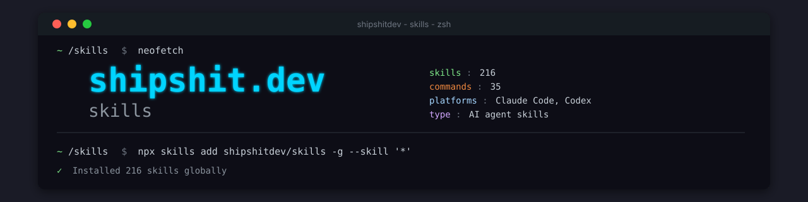

# Ship Shit Dev Skills


140 AI agent skills for development workflows. Works with Claude Code and OpenAI Codex.

## Directory Structure

```
skills/
├── skills/              # All skills (140)
├── commands/            # All commands (11)
├── bundles/             # Generated marketplace bundles
├── .agents/             # Repo management, memory, meta-skills
│   ├── SYSTEM/          # Architecture docs, skill standards
│   ├── memory/          # Repo decisions and context
│   └── skills/          # Meta-skills for maintaining this repo
├── .claude/             # Claude Code config (agents, rules)
├── .codex/              # Codex CLI config
└── scripts/             # Validation, generation, migration
```

## What's Included

- **The Dev Loop**: a board-driven autonomous workflow that ships software with
  `gh` + Claude + Codex.
- **Engineering Workflows**: code review, debugging, QA, release, GitHub triage,
  branch cleanup, production audit, and CI repair.
- **Implementation Specialists**: frontend, backend, infrastructure, security,
  testing, payments, and workspace setup skills.
- **Agent Engineering**: context engineering, memory systems, evaluation,
  multi-agent patterns, MCP building, and prompt/tool design.
- **Maintenance Tooling**: scripts that validate skills, regenerate bundles, and
  keep the marketplace catalog aligned with source.

## The Dev Loop — ship software with gh + Claude + Codex

The flagship workflow: a **board-driven autonomous dev loop** that turns a GitHub
issue into a reviewed PR, with you as architect/reviewer. It is the open, `gh`-driven
version of **ShipCode**'s pipeline — same stages, no app required.

- **Plan** (human): `feature-intake` → `writing-prds` / `writing-plans` write the PRD
  and implementation plan onto the issue.
- **Dispatch** (human opt-in): apply `dispatch:claude` (Claude lane),
  `dispatch:codex` (Codex lane), or `dispatch:openrouter` (OpenRouter lane) to a
  **Backlog** issue.
- **Execute** (AI): the loop claims it → **In Progress** → branch → implement →
  `qa-reviewer` + tests → PR, advancing `loop:*` phase labels as it goes.
- **Review** (human): the PR lands in **Human Review**, auto-assigned to you. Merge =
  Done; reject = back to Backlog.

Board columns are for humans (**Backlog · In Progress · Human Review · Done ·
Deferred**); the AI loop's sub-phases ride as `loop:*` labels. Status is the GitHub
Projects board `Status` field — the single source of truth.

```bash
# 1. Install the dev-loop bundle (every skill the loop needs)
/plugin marketplace add shipshitdev/skills
/plugin install shipshitdev-dev-loop@shipshitdev

# 2. Provision your repo: labels + board + workflows + secrets (idempotent)
bash scripts/setup-dev-loop.sh            # --dry-run to preview

# 3. Write your repo's routing block (tracker + labels + domain). In Claude Code:
/setup-agent-routing

# 4. Drive it
/loop                                     # Phase 1: local pull (Claude lane)
# …or apply dispatch:claude / dispatch:codex to fire Phase 2 (GitHub Actions)
```

Full reference: [`.agents/SYSTEM/AI-DEV-LOOP.md`](.agents/SYSTEM/AI-DEV-LOOP.md).

## Installation

### Quick Install (Recommended)

```bash
# Install all skills globally for Claude Code and Codex
npx skills add shipshitdev/skills -g --agent claude-code codex --skill '*' -y

# Install specific skills
npx skills add shipshitdev/skills -g --skill stripe-implementer -y

# List available skills
npx skills add shipshitdev/skills --list
```

> **Do NOT use `--all`** — it installs to every agent the CLI knows about (30+).
> Always use `--agent` to target only the agents you use.

### Project-local Install

```bash
npx skills add shipshitdev/skills --agent claude-code codex
```

### Claude Code Plugin (Alternative)

```bash
/plugin marketplace add shipshitdev/skills
/plugin install shipshitdev-dev-loop@shipshitdev
/plugin install shipshitdev-dev-workflow@shipshitdev
/plugin install shipshitdev-github@shipshitdev
/plugin install shipshitdev-testing@shipshitdev
/plugin install shipshitdev-security@shipshitdev
```

### For Contributors

```bash
git clone https://github.com/shipshitdev/skills.git ~/shipshitdev-skills
cd ~/shipshitdev-skills
npx skills add . -g --agent claude-code codex --skill '*' -y
```

## Adding Skills & Commands

### Adding a Skill

1. Create directory in `skills/skill-name/`
2. Add `SKILL.md` with YAML frontmatter
3. Update this README

```bash
mkdir -p skills/my-skill
touch skills/my-skill/SKILL.md
```

### Adding a Command

1. Create `.md` file in `commands/`
2. Follow naming: `{verb}-{noun}.md`
3. Update this README

## Documentation

- `.agents/SYSTEM/SKILL-STANDARDS.md` - Agent Skills spec + Claude Code extensions
- `.agents/SYSTEM/SKILL-MANAGEMENT.md` - Single-source skill workflow
- `.agents/SYSTEM/ARCHITECTURE.md` - .agents folder structure
- `.agents/SYSTEM/PLATFORM-ADAPTATIONS.md` - Claude vs Codex writing guide
- `.agents/SYSTEM/AI-DEV-LOOP.md` - Board-driven autonomous dev loop (`/loop` + agent-dispatch)

## Development Commands

| Command | Description |
|---------|-------------|
| bug | File a GitHub bug issue |
| clean | Clean completed tasks and consolidate session files |
| env | Scaffold and validate environment variables |
| feature | Capture requirements into PRD epics and GitHub issues |
| inbox | Capture quick tasks into a project inbox |
| loop | Claim and work one dispatch issue end-to-end |
| merge | Review and land open PRs into the trunk |
| performance | Analyze frontend, backend, database, and infrastructure performance |
| prompt | Optimize prompts for AI generation |
| release | Cut a trunk release with patch notes |
| scan | Run dependency, code, config, and OWASP security scans |

## Skills (140)

### Dev Loop (9)

`feature-intake`, `writing-prds`, `writing-plans`, `prd-quality-gate`, `task-prd-creator`, `executing-plans`, `setup-agent-routing`, `gh-project-board`, `qa-reviewer`

### Dev Workflow (33)

`agent-architecture-audit`, `agent-config-audit`, `ai-agent-cost-optimizer`, `ai-regression-testing`, `analyze-codebase`, `codebase-advisor`, `code-review`, `structural-review`, `full-code-review`, `commit-summary`, `changelog-generator`, `de-slop`, `debug`, `deploy`, `execution-debugging`, `deployment-composer`, `docs`, `llm-structured-output`, `merge-open-prs`, `production-audit`, `refactor-code`, `release`, `release-cleanup`, `release-pr-gates`, `scaffold`, `shape`, `skill-capture`, `skill-comply`, `skill-scout`, `systematic-debugging`, `receiving-code-review`, `verification-before-completion`, `worktree`

### GitHub (16)

`bug`, `gh-address-comments`, `gh-fix-ci`, `gh-inbox`, `gh-pr-publish`, `gh-project-board`, `gh-review-suggestions`, `github-actions-author`, `git-safety`, `feature-intake`, `merge-open-prs`, `release`, `release-cleanup`, `release-pr-gates`, `worktree`, `finishing-a-development-branch`

### Testing (6)

`playwright-e2e-init`, `tdd`, `testing-expert`, `testing-cicd-init`, `qa-reviewer`, `husky-test-coverage`

### Frontend & React (30)

`frontend-design`, `component-library`, `accessibility`, `audit`, `clarify`, `critique`, `design-consistency-auditor`, `html-style`, `layout`, `polish`, `quieter`, `react-component-performance`, `react-hook-form`, `theme-factory`, `react-patterns`, `react-refactor`, `react-testing-library`, `react-native-components`, `expo-architect`, `landing-page-vercel`, `micro-landing-builder`, `ai-loading-ux`, `table-filters`, `quick-view`, `nextjs-validator`, `nextra-writer`, `shadcn`, `shadcn-setup`, `tailwind`, `tailwind-validator`

### Backend & Data (8)

`api-design-expert`, `error-handling-expert`, `graphql-architect`, `nestjs-expert`, `incremental-fetch`, `turborepo`, `typescript-expert`, `typescript-refactor`

### Infrastructure (10)

`docker-expert`, `aws-infrastructure`, `ec2-backend-deployer`, `mongodb-migration-expert`, `mongodb-atlas-checker`, `monitoring-setup`, `nestjs-queue-architect`, `performance-expert`, `redis-caching`, `security-expert`

### Security (4)

`security-audit`, `security-expert`, `git-safety`, `open-source-checker`

### AI Agents (15)

`prompt-engineering`, `mcp-builder`, `skill-creator`, `context-fundamentals`, `context-optimization`, `context-degradation`, `context-engineering`, `memory-systems`, `multi-agent-patterns`, `tool-design`, `evaluation`, `advanced-evaluation`, `comment-mode`, `spec-first`, `agent-browser`

### Workspace Setup (11)

`fullstack-workspace-init`, `project-init-orchestrator`, `linter-formatter-init`, `clerk-validator`, `content-script-developer`, `package-architect`, `artifacts-builder`, `open-source-checker`, `devcontainer-setup`, `biome-validator`, `bun-validator`

### Planning & PRDs (8)

`roadmap-analyzer`, `cto-advisor`, `feature-intake`, `task-prd-creator`, `writing-prds`, `prd-quality-gate`, `rules-capture`, `writing-plans`

### Payments & Product Integrations (1)

`stripe-implementer`

### Session Management (7)

`agent-folder-init`, `session-end`, `session-start`, `session-documenter`, `executing-plans`, `setup-agent-routing`, `workspace-performance-audit`

## How Skills Adapt to Projects

Skills are **adaptive** - they scan project documentation to understand:

- Project architecture and structure
- Tooling, scripts, and CI conventions
- Existing patterns and conventions
- Domain terminology and implementation constraints

If a project has its own skill, the generic skill will collaborate with or defer to it.

## Publishing & CI/CD

When you push to `master`, GitHub Actions automatically regenerates the `bundles/` directory to keep marketplace plugins in sync with skills.

### Claude Marketplace

Users install directly from GitHub:

```bash
# Add the marketplace
/plugin marketplace add shipshitdev/skills

# Install category bundles
/plugin install shipshitdev-dev-loop@shipshitdev
/plugin install shipshitdev-dev-workflow@shipshitdev
/plugin install shipshitdev-github@shipshitdev
/plugin install shipshitdev-testing@shipshitdev
/plugin install shipshitdev-frontend@shipshitdev
/plugin install shipshitdev-backend@shipshitdev
/plugin install shipshitdev-infrastructure@shipshitdev
/plugin install shipshitdev-security@shipshitdev
/plugin install shipshitdev-session@shipshitdev
/plugin install shipshitdev-planning@shipshitdev
```
