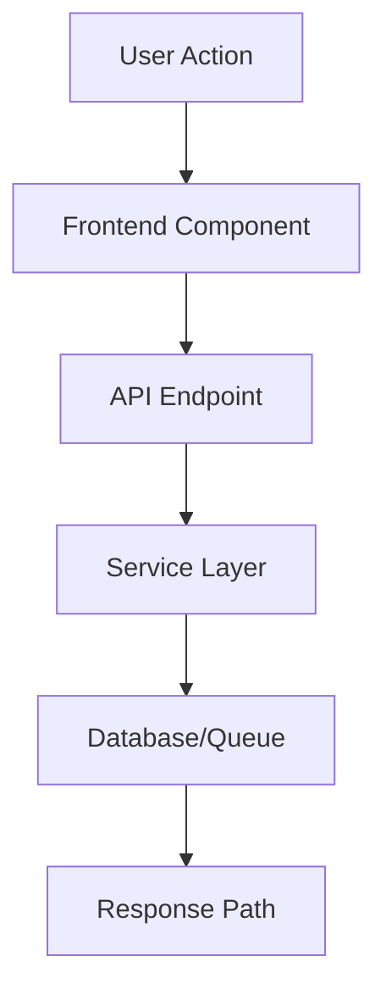
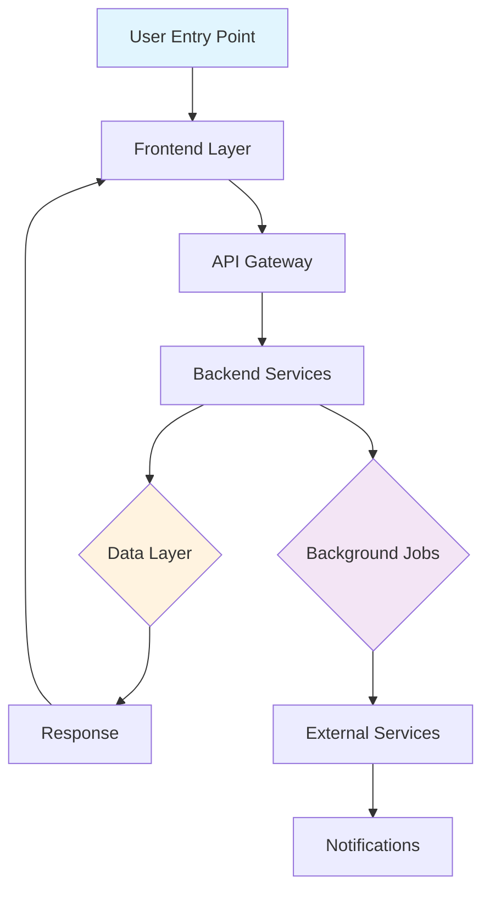

# Session Documenter Skill

**Purpose:** Automatically document all work, decisions, and context throughout the session for continuity.

**Auto-activation:** This skill activates automatically when you complete tasks to ensure documentation is never skipped.

---

## When This Skill Activates

**Trigger conditions:**
1. ✅ When a task from TodoList is marked as completed
2. ✅ When files are modified/created/deleted
3. ✅ When architectural decisions are made
4. ✅ When new patterns are established
5. ✅ At session end (MANDATORY)

**DO NOT wait for user to request documentation** - This is automatic.

---

## Critical Rules

### 1. Session File Naming (MANDATORY)

**ONE FILE PER DAY - NOT MULTIPLE FILES**

**✅ CORRECT:**
```
.agent/SESSIONS/2025-11-15.md  ← Today's file with ALL sessions
```

**❌ FORBIDDEN:**
```
.agent/SESSIONS/2025-11-15-feature-name.md
.agent/SESSIONS/2025-11-15-bugfix.md
.agent/SESSIONS/DEPLOYMENT-GUIDE-2025-11-15.md
```

**Rule:** Multiple sessions same day → Same file, Session 1, Session 2, Session 3, etc.

### 2. Required Protocols

**MUST follow these protocols:**
- `.agent/SYSTEM/ai/SESSION-DOCUMENTATION-PROTOCOL.md` - Complete documentation requirements
- `.agent/SESSIONS/TEMPLATE.md` - Session entry format
- `.agent/SESSIONS/README.md` - Session organization

### 3. Flowcharts (MANDATORY for features)

**ALWAYS include flowchart for:**
- ✅ New features
- ✅ Feature modifications
- ✅ Bug fixes affecting multiple components
- ✅ Performance optimizations

**Skip for:**
- ❌ Typo fixes
- ❌ Documentation-only changes

---

## Phase 1: Session Start (Auto-Execute)

**At the START of every session:**

1. **Check if today's session file exists:**
   ```bash
   scripts/sh/validate-session-start.sh
   ```

2. **If exists:**
   - Read `.agent/SESSIONS/$(date +%Y-%m-%d).md`
   - Review what was done today
   - Check for incomplete work
   - Note decisions already made

3. **If not exists:**
   - Run `scripts/sh/new-session.sh` to create file
   - Uses template from `.agent/SESSIONS/TEMPLATE.md`
   - Auto-fills date and project name

**Output to user:**
```
📋 Session Start: Read today's session file
✅ Found: .agent/SESSIONS/2025-11-15.md with 2 previous sessions
🎯 Continuing from Session 2 context...
```

**OR:**

```
📋 Session Start: Creating today's session file
✅ Created: .agent/SESSIONS/2025-11-15.md
🎯 Ready to document Session 1
```

---

## Phase 2: During Session (Auto-Track)

**Track automatically as you work:**

### Track All Decisions

When making decisions, document immediately:

```markdown
### Decision: [Title]

**Context:** Why this decision was needed
**Options Considered:**
1. Option A - Pros/Cons
2. Option B - Pros/Cons (Chosen)
**Decision:** What was decided and why
**Impact:** How this affects the project
```

**Store in memory during session, write to file after task completion.**

### Track All File Changes

Monitor file operations:

```markdown
### Files Changed

**Created:**
- `path/to/new-file.ts` - Purpose

**Modified:**
- `path/to/existing-file.ts` - Changes made

**Deleted:**
- `path/to/old-file.ts` - Reason
```

**Aggregate all changes from task completion.**

### Track Patterns Used

Document new patterns:

```markdown
### Patterns Established

- **Import patterns** - How imports were structured
- **Error handling** - Error handling approach used
- **State management** - How state was managed
- **API patterns** - API structure and conventions
```

### Track Mistakes and Fixes

Learn from errors:

```markdown
### Mistake: [Title]

**What Went Wrong:** Description
**Root Cause:** Why it happened
**Fix:** How it was resolved
**Prevention:** How to prevent in future
```

---

## Phase 3: After Task Completion (Auto-Document)

**When a task is marked COMPLETED in TodoList:**

### 1. Determine Session Number

Read today's session file to find the current session count:

```bash
# Extract session number
SESSIONS_COUNT=$(grep -c "^## Session" .agent/SESSIONS/$(date +%Y-%m-%d).md 2>/dev/null || echo "0")
NEXT_SESSION=$((SESSIONS_COUNT + 1))
```

### 2. Create Session Entry

**If this is the first task completed today (Session 1):**

Add to `.agent/SESSIONS/YYYY-MM-DD.md`:

````markdown
# Sessions: YYYY-MM-DD

**Summary:** Brief 3-5 word summary

---

## Session 1: [Brief Description]

**Duration:** ~X hours
**Status:** ✅ Complete / 🔄 In Progress

### System Flow Diagram

**⭐ FEATURE IMPACT FLOWCHART:**



**OR text-based:**

```
1. User clicks [Action] in [Component.tsx]
   ↓
2. Frontend calls POST /api/[endpoint]
   ↓
3. [controller.ts] receives request
   ↓
4. [service.ts] processes business logic
   ↓
5. [MongoDB/Redis] data operation
   ↓
6. Response returned to frontend
   ↓
7. UI updates with result
```

**Affected Components:**
- **Frontend:**
  - `path/to/component.tsx` - [what it does]
- **Backend:**
  - `path/to/controller.ts` - [what it does]
  - `path/to/service.ts` - [what it does]
- **Data:**
  - MongoDB: `collection_name` - [schema]
  - Redis: `key_pattern` - [cache strategy]
- **Background:**
  - Queue: `queue-name` - [job type]
- **External:**
  - [Service Name] API - [endpoints used]

**What was done:**
- ✅ Task completed
- ✅ Another task
- 🔄 Partial/in-progress task

**Libraries & Documentation Used:**
- **[Library]** (via Context7 `/org/project`) - [usage]

**Key decisions:**
- Decision with rationale

**Impact:**
- How this affects system

**Files changed:**
- `path/file.ts` - [what changed]

**Mistakes and fixes:**
- [If any mistakes were made and fixed]

**Next steps:**
- [What should be done next]

---

**Total sessions today:** 1
````

**If adding another task to existing session (same session continues):**

Update the existing Session entry with:
- Add completed task to "What was done"
- Add any new files to "Files changed"
- Add any new decisions to "Key decisions"

**If this is a NEW session (different work area):**

Add new session at TOP of file:

```markdown
## Session 2: [New Brief Description]

[Full session entry as above]

---

## Session 1: [Previous Session]
[Previous content...]

---

**Total sessions today:** 2
```

### 3. Update Related Files

After documenting session, update:

**a) `.agent/SESSIONS/README.md` (if new file created today):**

```markdown
## Recent Sessions (Quick Links)

- [2025-11-15](./2025-11-15.md) - Brief description
```

**b) `.agent/SYSTEM/SUMMARY.md`:**

```markdown
**Last Updated:** 2025-11-15

### Recent Changes (Last 7 Days)

#### Completed
- ✅ Task description - Brief details
```

**c) Relevant TODO.md files:**

Mark completed tasks:

```markdown
- [x] Completed task
- [ ] Remaining task
```

**d) `.agent/SYSTEM/ARCHITECTURE.md` (if architectural decisions):**

Add significant decisions using ADR format.

**e) `.agent/SOP/*.md` (if new patterns established):**

Document reusable patterns with examples.

---

## Automation Flow

```
1. User works on task
   ↓
2. TodoWrite marks task as completed
   ↓
3. session-documenter skill AUTOMATICALLY ACTIVATES
   ↓
4. Skill reads today's session file (or creates it)
   ↓
5. Skill aggregates all tracked data:
   - Decisions made
   - Files changed
   - Patterns used
   - Mistakes fixed
   ↓
6. Skill creates/updates session entry
   ↓
7. Skill updates related files:
   - SESSIONS/README.md
   - SYSTEM/SUMMARY.md
   - TASKS/*/TODO.md
   - ARCHITECTURE.md (if needed)
   - SOP/*.md (if needed)
   ↓
8. Skill validates ONE FILE PER DAY rule
   ↓
9. Skill confirms to user:
   "✅ Session documented in .agent/SESSIONS/2025-11-15.md"
```

---

## User-Facing Messages

**At session start:**
```
📋 Session Start Checklist:
✅ Read today's session file: .agent/SESSIONS/2025-11-15.md
✅ Found 2 previous sessions today
🎯 Ready to continue with Session 3
```

**After task completion:**
```
✅ Task completed: [Task name]
📝 Documenting in session file...
✅ Updated: .agent/SESSIONS/2025-11-15.md (Session 1)
📊 Files changed: 3 modified, 1 created
💡 Decisions documented: 2
```

**At session end:**
```
📋 Session End Summary:
✅ Session 1 documented
📂 Files updated:
   - .agent/SESSIONS/2025-11-15.md
   - .agent/SESSIONS/README.md
   - .agent/SYSTEM/SUMMARY.md
   - .agent/TASKS/api/TODO.md
✨ Session complete and documented
```

---

## Validation Rules

**Before writing session entry, verify:**

- [ ] Today's session file uses `YYYY-MM-DD.md` format (no suffix)
- [ ] Only ONE file per day (not multiple)
- [ ] Flowchart included (for feature work)
- [ ] All decisions documented
- [ ] All files changed listed
- [ ] Mistakes documented (if any)
- [ ] Next steps noted
- [ ] Libraries used documented (with Context7 IDs if applicable)

**Auto-fix violations:**

If multiple files exist for today (e.g., `2025-11-15-feature.md`, `2025-11-15-bugfix.md`):

```bash
scripts/sh/validate-sessions.sh  # Auto-consolidates into single file
```

---

## Integration with Existing Scripts

**Use these existing bash scripts:**

1. **`scripts/sh/new-session.sh`**
   - Creates today's session file from template
   - Auto-fills date and project

2. **`scripts/sh/validate-session-start.sh`**
   - Checks if today's file exists
   - Validates content

3. **`scripts/sh/validate-sessions.sh`**
   - Finds naming violations
   - Auto-consolidates multiple files into one

4. **`scripts/sh/sessions-clean.sh`**
   - Consolidates daily → monthly → yearly
   - Creates backups

**Call these scripts via Bash tool as needed.**

---

## Flowchart Generation Guide

### When to Include

**ALWAYS for:**
- New features
- Feature modifications
- Multi-component bug fixes
- Performance optimizations

**NEVER for:**
- Typo fixes
- Doc-only changes
- Single-line changes

### Format Options

**Option 1: Mermaid (Visual)**



**Option 2: Simple Text Flow**

```
1. User Action → 2. Frontend → 3. API → 4. Service → 5. Database → 6. Response
```

**Option 3: Detailed List**

```
1. User clicks "Submit" in FormComponent.tsx
   ↓
2. Form validates data (Zod schema)
   ↓
3. API call: POST /api/items
   ↓
4. items.controller.ts receives request
   ↓
5. items.service.ts processes logic
   ↓
6. MongoDB saves to 'items' collection
   ↓
7. Response returned (201 Created)
   ↓
8. Frontend updates UI
```

**Choose the format that best shows the system impact.**

---

## Memory Tracking During Session

**Maintain in-memory state:**

```typescript
interface SessionMemory {
  decisions: Decision[];
  filesChanged: FileChange[];
  patternsEstablished: Pattern[];
  mistakes: Mistake[];
  librariesUsed: Library[];
  tasksCompleted: Task[];
}
```

**Update memory as work progresses, write to file after task completion.**

---

## Example Session Entry (Full)

````markdown
# Sessions: 2025-11-15

**Summary:** Implemented user authentication flow

---

## Session 1: Clerk Authentication Integration

**Duration:** ~2 hours
**Status:** ✅ Complete

### System Flow Diagram

**⭐ AUTHENTICATION FLOW:**

```
1. User clicks "Sign In" button in Header.tsx
   ↓
2. ClerkProvider handles OAuth redirect
   ↓
3. Clerk API authenticates user
   ↓
4. JWT token returned to frontend
   ↓
5. AuthContext.tsx stores user state
   ↓
6. Protected routes check auth status
   ↓
7. API calls include JWT in Authorization header
   ↓
8. Backend ClerkAuthGuard validates token
   ↓
9. Request proceeds if valid
```

**Affected Components:**
- **Frontend:**
  - `app/_layout.tsx` - Added ClerkProvider wrapper
  - `contexts/AuthContext.tsx` - Created auth state management
  - `components/Header.tsx` - Sign in/out buttons
- **Backend:**
  - `apps/api/src/auth/clerk-auth.guard.ts` - JWT validation
  - All protected controllers - Added @UseGuards(ClerkAuthGuard)
- **External:**
  - Clerk API - OAuth flow, JWT issuing

**What was done:**
- ✅ Integrated Clerk SDK in mobile app
- ✅ Created auth context provider
- ✅ Implemented protected routes
- ✅ Added auth guards to backend controllers
- ✅ Tested sign in/out flow

**Libraries & Documentation Used:**
- **Clerk** (via Context7 `/clerk/javascript`) - Authentication setup, useAuth hook patterns
- **NestJS** (via Context7 `/nestjs/nestjs`) - Guard implementation
- **React Native** - Context API, navigation guards

**Key decisions:**
- **Use Clerk's useAuth hook** instead of custom implementation
  - Rationale: Clerk provides battle-tested auth state management
  - Considered: Custom JWT management, but adds complexity
  - Impact: Faster implementation, better security

- **Store auth state in React Context** for global access
  - Rationale: Needed across many components
  - Considered: Redux, Zustand, but overkill for auth state
  - Impact: Simple, performant, meets needs

**Impact:**
- All routes now protected by authentication
- User context available throughout app
- Backend validates all protected endpoints
- No breaking changes to existing unprotected routes

**Files changed:**
- `app/_layout.tsx` - Added ClerkProvider wrapper
- `contexts/AuthContext.tsx` - Created new auth context with useAuth
- `components/Header.tsx` - Added SignInButton and UserButton
- `apps/api/src/auth/clerk-auth.guard.ts` - Created JWT validation guard
- `apps/api/src/posts/posts.controller.ts` - Added @UseGuards(ClerkAuthGuard)
- `apps/api/src/brands/brands.controller.ts` - Added @UseGuards(ClerkAuthGuard)

**Mistakes and fixes:**
- **Mistake:** Initially forgot to add cleanup in AuthContext useEffect
  - **Root Cause:** Didn't follow singleton cleanup pattern
  - **Fix:** Added cleanup function to unsubscribe from Clerk events
  - **Prevention:** Always add cleanup in useEffect when subscribing to events

**Next steps:**
- [ ] Add refresh token rotation
- [ ] Implement role-based access control (RBAC)
- [ ] Add session timeout handling
- [ ] Write integration tests for auth flow

---

**Total sessions today:** 1
````

---

## Quick Reference

**Session file location:** `.agent/SESSIONS/YYYY-MM-DD.md`
**Naming rule:** ONE FILE PER DAY (not multiple)
**Format reference:** `.agent/SESSIONS/TEMPLATE.md`
**Protocol:** `.agent/SYSTEM/ai/SESSION-DOCUMENTATION-PROTOCOL.md`
**Bash scripts:** `scripts/sh/new-session.sh`, `scripts/sh/validate-sessions.sh`

**When in doubt:**
- Document more rather than less
- Include flowcharts for features
- Note decisions with rationale
- Track mistakes and fixes
- Update after each task completion

---

## Checklist for Auto-Documentation

**At session start:**
- [ ] Check/create today's session file
- [ ] Read existing sessions (if any)
- [ ] Note incomplete work from previous sessions

**During session (auto-track):**
- [ ] Track all decisions made
- [ ] Note all files changed
- [ ] Document patterns used
- [ ] Record mistakes and fixes

**After task completion (auto-write):**
- [ ] Add session entry to today's file
- [ ] Include flowchart (for features)
- [ ] Include all required sections
- [ ] Update SESSIONS/README.md (if new file)
- [ ] Update SYSTEM/SUMMARY.md
- [ ] Update relevant TODO.md files
- [ ] Update ARCHITECTURE.md (if decisions)
- [ ] Update SOP/*.md (if patterns)

**At session end (validate):**
- [ ] Verify ONE FILE PER DAY rule
- [ ] Verify all tasks documented
- [ ] Verify all decisions noted
- [ ] Verify all files listed
- [ ] Verify next steps included

---

**Remember:** This skill activates AUTOMATICALLY - you don't need to be asked to document. Documentation is MANDATORY, not optional.
