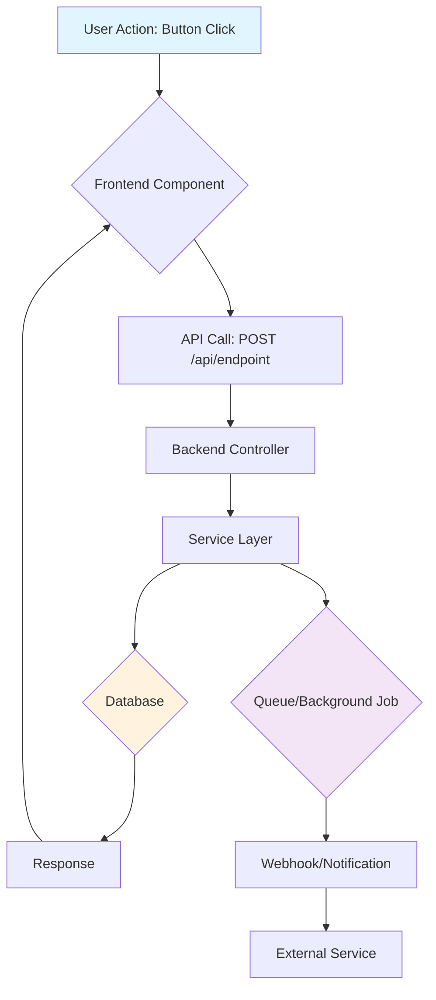
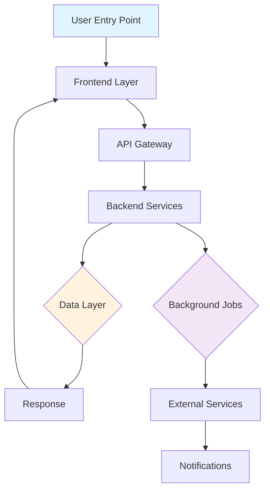
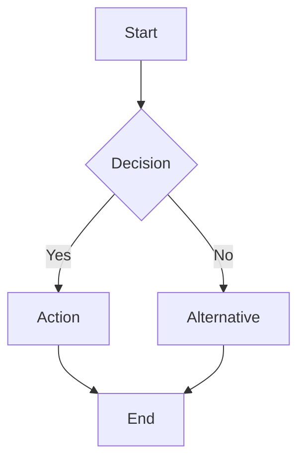

# Update Documentation - Session Continuity Command

This command ensures comprehensive tracking of all work, decisions, and context for session continuity.

> **Note for Solo Developers:** This focuses on WHAT was done and WHY, not time estimates or velocity metrics. Just build and document. No sprints, no burndown charts, no estimates.

## 🚨 CRITICAL RULE: NO .MD FILES AT WORKSPACE ROOT

**NEVER CREATE .MD FILES AT WORKSPACE ROOT LEVEL**

**ONLY 4 files allowed at root:**

- `AGENTS.md` - Navigation file
- `CLAUDE.md` - AI agent config
- `CODEX.md` - AI agent config
- `README.md` - Project README

**FORBIDDEN at root:**

- `MIGRATION-STATUS.md`
- `COMPLETE-*.md`
- `IMPLEMENTATION-*.md`
- `READY-TO-TEST.md`
- ANY other .md files

**WHERE TO PUT THEM:**

| File Type             | Correct Location                             |
| --------------------- | -------------------------------------------- |
| Migration/Task status | GitHub Issues (gh issue create)              |
| Architecture docs     | `.agents/memory/[topic].md`                   |
| Session notes         | `.agents/sessions/YYYY-MM-DD.md`              |

**BEFORE creating ANY .md file, ask yourself:**

1. Is this AGENTS.md, CLAUDE.md, CODEX.md, or README.md?
   - NO → It goes in `.agents/` folder
   - YES → Only update, never recreate

## What This Command Does

Updates all critical documentation files to track:

1. **Session Context** - Key decisions, changes, and learnings
2. **Project Memory** - Durable architectural facts
3. **GitHub Issues** - Open task status

## Files to Update

### 1. Session File (MANDATORY)

**CRITICAL: ONE FILE PER DAY - NOT MULTIPLE FILES!**

**Location:** `/.agents/sessions/YYYY-MM-DD.md`

**Naming:** `YYYY-MM-DD.md` (e.g., `2025-10-08.md`)

**WRONG:**

```
.agents/sessions/2025-10-08-feature-1.md
.agents/sessions/2025-10-08-feature-2.md
.agents/sessions/2025-10-08-bugfix.md
```

**CORRECT:**

```
.agents/sessions/2025-10-08.md  ← ONE file with MULTIPLE sessions
```

**File Structure:**

```markdown
# Sessions: YYYY-MM-DD

**Summary:** 3-5 word summary of day's work

---

## Session 1: First Feature

[Session details...]

---

## Session 2: Second Feature

[Session details...]

---

**Total sessions today:** 2
```

**If file already exists:** Add NEW session at TOP of file, increment session number

### 2. Project Memory (IF APPLICABLE)

**Directory:** `/.agents/memory/`

Update a memory file if architectural decisions were made, new patterns established, or durable project facts changed. Each file covers one topic and carries `last_verified: YYYY-MM-DD` at the top.

**When to update:**

- Architectural decisions were made
- New patterns established
- Deployment or infrastructure changed
- Key gotchas discovered

**Example files:**

- `.agents/memory/repo_architecture.md`
- `.agents/memory/repo_deployment.md`
- `.agents/memory/repo_patterns.md`

### 3. GitHub Issues (IF APPLICABLE)

If work completed an open issue:

```bash
gh issue close <number> --comment "Implemented in commit <sha>. <brief summary>"
```

If work is blocked:

```bash
gh issue comment <number> --body "Blocked: [reason]. Will resume when [condition]."
```

### 4. Root-Level CLAUDE.md (IF APPLICABLE)

**File:** `/CLAUDE.md`

If there are critical updates to project rules, never-do items, or working agreements — add them to CLAUDE.md so they're loaded automatically next session.

## Step-by-Step Process

### Step 0: Fetch Latest Library Documentation (RECOMMENDED)

**Use Context7 MCP to get up-to-date documentation for libraries/frameworks used in this session:**

**Common Libraries to Check:**

- **Backend:** mongodb, nestjs, mongoose, redis, bullmq
- **Frontend:** next.js (vercel/next.js), react, tailwind
- **Services:** stripe, clerk, aws-sdk
- **AI:** openai, replicate, anthropic

**Example Workflow:**

```typescript
// 1. Resolve library ID
mcp_context7_resolve_library_id({ libraryName: 'mongodb' });
// Returns: /mongodb/docs

// 2. Get documentation
mcp_context7_get_library_docs({
  context7CompatibleLibraryID: '/mongodb/docs',
  topic: 'aggregation pipeline',
  tokens: 5000,
});
```

### Step 1: Plan & Visualize System Impact

**MANDATORY FOR FEATURE WORK: CREATE A FLOWCHART**

Before implementing any feature, create a flowchart showing how the feature interacts with all parts of the system.

**Required Elements:**

1. **User Entry Point** - Where does the user trigger this feature?
2. **Data Flow** - How does data move through the system?
3. **Components Impacted** - Which files/services are affected?
4. **External Services** - APIs, databases, queues, etc.
5. **Response Path** - How does the result get back to the user?

**Flowchart Format (Text-based):**



**When to Create:**

- Always for new features
- Always for feature modifications
- For bug fixes affecting multiple components
- For performance optimizations
- Skip for typo fixes or documentation-only changes

**Include in Session File:**
The flowchart MUST be included in the session file under "System Flow Diagram" section.

---

### Step 2: Reflect on Session

Before updating files, answer these questions:

**What was accomplished?**

- [ ] List all completed tasks
- [ ] Note any partial completions
- [ ] Identify blocked items

**What decisions were made?**

- [ ] Technical approach decisions
- [ ] Architecture changes
- [ ] Pattern establishments
- [ ] Tool or library choices

**What issues were discovered?**

- [ ] New bugs found
- [ ] Performance issues
- [ ] Security concerns
- [ ] Technical debt identified

**What patterns emerged?**

- [ ] New coding patterns
- [ ] Reusable components
- [ ] Common solutions
- [ ] Best practices

**What should next session know?**

- [ ] Critical context
- [ ] Gotchas or surprises
- [ ] Incomplete work details
- [ ] Next steps

### Step 3: Create or Update Daily Session File

**REMEMBER: ONE FILE PER DAY, NOT MULTIPLE FILES!**

**Files MUST go in `.agents/sessions/` - NEVER at workspace root!**

1. **Create or update `.agents/sessions/YYYY-MM-DD.md`** (today's date)
   - **Filename:** `YYYY-MM-DD.md` (NO descriptive suffix!)
   - **If file doesn't exist:** Create new file with first session + 3-5 word summary
   - **If file exists:** Add new session at TOP of file, update total count
   - Include all session details, decisions, and context
   - **Include libraries used:** Note which libraries were consulted via Context7
   - **INCLUDE FLOWCHART:** Add system flow diagram for feature work

   **New file format:**

   ````markdown
   # Sessions: YYYY-MM-DD

   **Summary:** Brief 3-5 word summary

   ---

   ## Session 1: [Brief Description]

   **Duration:** ~X hours  
   **Status:** Complete / In Progress

   ### System Flow Diagram

   **FEATURE IMPACT FLOWCHART:**

   ```mermaid
   graph TD
       A[User Action] --> B[Frontend Component]
       B --> C[API Endpoint]
       C --> D[Service Layer]
       D --> E[Database/Queue]
       E --> F[Response Path]
   ```
   ````

   **Affected Components:**
   - Frontend: `path/to/component.tsx`
   - Backend: `path/to/controller.ts`, `path/to/service.ts`
   - Database: `collection_name`
   - Queue: `queue-name`
   - External: OpenAI API / Clerk Auth / etc.

   **What was done:**
   - Tasks completed

   **Libraries & Documentation Used:**
   - **[Library]** (via Context7 `/org/project`) - [usage]

   **Key decisions:**
   - Decision with rationale

   **Impact:**
   - How this affects system

   **Files changed:**
   - `path/file.ts` - [what changed]

   ---

   **Total sessions today:** 1

   ````

   **Adding a second session same day:**
   ```markdown
   # Sessions: YYYY-MM-DD

   **Summary:** Updated summary if needed

   ---

   ## Session 2: [New Session]

   [Session details with flowchart if feature work...]

   ---

   ## Session 1: [Previous Session]

   [Previous session content...]

   ---

   **Total sessions today:** 2
   ````

### Step 4: Update Memory & Issues

1. **Update `.agents/memory/[topic].md`** if architectural decisions were made
   - Update `last_verified` date at top of file
   - Add any new patterns, gotchas, or facts
   - Remove or correct stale information

2. **Close or update GitHub Issues** for completed work

   ```bash
   gh issue close <number> --comment "Done in <sha>: <summary>"
   ```

3. **Document Decisions (if applicable)**
   - Add to `.agents/memory/repo_architecture.md` or create a new memory file
   - Follow ADR format if significant

4. **Update `.http` Files (if API endpoints changed)**
   - Co-located with controller (e.g., `public.brands.http` next to `public.brands.controller.ts`)
   - Add new endpoint examples
   - Update request/response bodies

### Step 5: Verify Completeness

Check that you've documented:

- [x] What was done (tasks completed)
- [x] Why it was done (decisions, rationale)
- [x] How it was done (patterns, approaches)
- [x] System flow diagram (for features)
- [x] What's next (remaining work)
- [x] What to remember (critical context)

### Step 6: Code Verification (IMPORTANT)

**USE PARALLEL BUILD FOR VERIFICATION**

After making changes, verify the build compiles successfully:

1. **Run parallel build** (Frontend projects):

   ```bash
   cd [frontend-project]
   bun run build:all
   ```

2. **Run linter** (if applicable):

   ```bash
   bun run lint
   ```

3. **Run TypeScript type checking** (if applicable):

   ```bash
   bun run typecheck
   ```

**What NOT to do:**

- Do NOT run `pnpm build` (single-threaded, slow)
- Do NOT skip build verification

## Quick Templates

### Daily Session File Template

**ONE FILE PER DAY: `/.agents/sessions/YYYY-MM-DD.md` (not YYYY-MM-DD-description.md)**

**If new file:**

````markdown
# Sessions: YYYY-MM-DD

**Summary:** 3-5 word summary of day's work

---

## Session 1: [Brief Description]

**Duration:** ~X hours  
**Status:** Complete

### System Flow Diagram

**FEATURE IMPACT FLOWCHART:**


````

**Or Simple Text Flow:**

```
1. User clicks [Action] in [Component.tsx]
   ↓
2. Frontend calls POST /api/[endpoint]
   ↓
3. [controller.ts] receives request
   ↓
4. [service.ts] processes business logic
   ↓
5. [MongoDB/Redis] data operation
   ↓
6. [BullMQ Queue] background job (if async)
   ↓
7. [External API] third-party service
   ↓
8. Response returned to frontend
   ↓
9. UI updates with result
```

**Affected Components:**

- **Frontend:**
  - `apps/[app]/components/[Component].tsx` - [what it does]
  - `apps/[app]/services/[Service].ts` - [what it does]
- **Backend:**
  - `apps/api/src/[module]/[controller].ts` - [what it does]
  - `apps/api/src/[module]/[service].ts` - [what it does]
- **Data:**
  - MongoDB: `[collection_name]` - [schema changes]
  - Redis: `[key_pattern]` - [cache strategy]
- **Background:**
  - Queue: `[queue-name]` - [job type]
- **External:**
  - [Service Name] API - [endpoints used]

**What was done:**

- Completed task
- Another task
- Partial/in-progress task

**Libraries & Documentation Used:**

- **[Library Name]** (via Context7 `/org/project`) - [What it was used for, specific APIs]
- **[Framework]** (v[version]) - [Specific feature/pattern used]

**Key decisions:**

- Decision description with rationale
- Another decision

**ADR-XXXX: [Decision Title]** (if applicable)

- **Context:** Why this decision was needed
- **Decision:** What was decided
- **Alternatives:** Options considered (rejected - why)
- **Consequences:** Impact on system

**Impact:**

- What changed in the codebase
- What to be aware of
- Any breaking changes or gotchas

**Files changed:**

- `path/to/file.ts` - [what changed]
- `path/to/another.tsx` - [what changed]

---

**Total sessions today:** 1

````

**If file exists (multiple sessions same day), add at TOP:**
```markdown
## Session 2: [Brief Description]

[Same format as above, including flowchart for feature work]

---
````

Then update the total count at bottom of file.

### Architecture Decision Template

```markdown
## [Decision Title]

**Date:** YYYY-MM-DD  
**Status:** Accepted/Proposed/Deprecated

### Context

[What is the issue/problem that needs to be addressed?]

### Decision

[What decision was made and why?]

### Alternatives Considered

- **Option 1:** [Description] - [Pros/Cons]
- **Option 2:** [Description] - [Pros/Cons]

### Consequences

- **Positive:** [Benefits of this decision]
- **Negative:** [Trade-offs or costs]
- **Risks:** [Potential issues to watch for]
```

## Critical Context Checklist

Before ending session, ensure these are documented:

### Code Changes

- [ ] Which files were modified
- [ ] Why they were changed
- [ ] Any patterns established
- [ ] Related files to check

### System Flow (for features)

- [ ] Flowchart created showing all component interactions
- [ ] Entry point documented
- [ ] Data flow mapped
- [ ] Affected services listed
- [ ] External dependencies noted

### Incomplete Work

- [ ] What's partially done
- [ ] Why it's incomplete
- [ ] What needs to happen next
- [ ] Any blockers encountered

### Discoveries

- [ ] New issues found
- [ ] Performance insights
- [ ] Security considerations
- [ ] Technical debt identified

### Next Steps

- [ ] Immediate priorities
- [ ] Dependencies to resolve
- [ ] Testing needed
- [ ] Documentation to create

## Examples

### Example 1: Feature Implementation with Flowchart

**Session Work:** Implemented user authentication with Clerk

**Updates:**

1. Create or update `/.agents/sessions/2025-10-07.md`:

   ```markdown
   # Sessions: 2025-10-07

   ## Session 1: Clerk Authentication Implementation

   ### System Flow Diagram

   **AUTHENTICATION FLOW:**
   ```

   1. User clicks "Sign In" button in Header.tsx
      ↓
   2. ClerkProvider handles OAuth redirect
      ↓
   3. Clerk API authenticates user
      ↓
   4. JWT token returned to frontend
      ↓
   5. AuthContext.tsx stores user state
      ↓
   6. Protected routes check auth status
      ↓
   7. API calls include JWT in Authorization header
      ↓
   8. Backend ClerkAuthGuard validates token
      ↓
   9. Request proceeds if valid

   ```

   **Affected Components:**
   - **Frontend:**
     - `app/_layout.tsx` - Added ClerkProvider wrapper
     - `contexts/AuthContext.tsx` - Created auth state management
     - `components/Header.tsx` - Sign in/out buttons
   - **Backend:**
     - `apps/api/src/auth/clerk-auth.guard.ts` - JWT validation
     - All protected controllers - Added @UseGuards(ClerkAuthGuard)
   - **External:**
     - Clerk API - OAuth flow, JWT issuing

   **What was done:**
   - Integrated Clerk SDK in mobile app
   - Created auth context provider
   - Implemented protected routes

   **Libraries & Documentation Used:**
   - **Clerk** (via Context7 `/clerk/javascript`) - Authentication setup, useAuth hook patterns
   - **React Native** - Context API, navigation guards

   **Key decisions:**
   - Use Clerk's useAuth hook instead of custom implementation
   - Store auth state in React Context for global access

   **Impact:**
   - All routes now protected by authentication
   - User context available throughout app

   **Files changed:**
   - `app/_layout.tsx` - Added ClerkProvider
   - `contexts/AuthContext.tsx` - Created auth context

   ---

   **Total sessions today:** 1
   ```

2. Update `.agents/memory/repo_auth.md` (or create it):

   ```markdown
   ---
   last_verified: 2025-10-07
   ---

   # Auth Architecture

   **Provider:** Clerk (OAuth + JWT)
   **Guard:** ClerkAuthGuard on all protected routes
   **User context:** Available via @CurrentUser() decorator
   **Frontend:** useAuth() hook from Clerk SDK
   ```

3. Close relevant GitHub Issue if auth was tracked:

   ```bash
   gh issue close 12 --comment "Implemented. Clerk auth integrated, all routes protected."
   ```

## Maintenance Notes

- **Run this command at END of every session**
- **Use Context7 MCP BEFORE implementing features** - get latest library docs
- **ALWAYS create flowcharts for feature work** - visualize system impact
- **ALWAYS verify builds** - Use `bun run build:all` to check compilation
- Don't skip updates - session context is critical
- Be specific - generic entries don't help future sessions
- Update dates - helps track staleness
- Link related GitHub Issues in session notes

## Context7 MCP Quick Reference

**Available for this project:**

| Category        | Libraries  | Context7 ID                           |
| --------------- | ---------- | ------------------------------------- |
| **Backend**     | MongoDB    | `/mongodb/docs`                       |
|                 | NestJS     | `/nestjs/nestjs`                      |
|                 | Mongoose   | `/mongoosejs/mongoose`                |
|                 | Redis      | `/redis/redis`                        |
|                 | BullMQ     | `/taskforcesh/bullmq`                 |
| **Frontend**    | Next.js    | `/vercel/next.js`                     |
|                 | React      | `/facebook/react`                     |
|                 | Tailwind   | `/tailwindlabs/tailwindcss`           |
|                 | Clerk      | `/clerk/javascript`                   |
| **AI Services** | OpenAI     | `/openai/openai-node`                 |
|                 | Anthropic  | `/anthropic/anthropic-sdk-typescript` |
| **Cloud**       | AWS SDK    | `/aws/aws-sdk-js-v3`                  |
|                 | Vercel     | `/vercel/vercel`                      |
| **Testing**     | Jest       | `/jestjs/jest`                        |
|                 | Playwright | `/microsoft/playwright`               |

**Usage Pattern:**

1. **Before feature implementation** → Use Context7 to get latest library docs
2. **During debugging** → Reference error handling patterns from Context7
3. **When updating dependencies** → Check migration guides via Context7
4. **In session notes** → Document which libs were used with Context7 ID

## Flowchart Best Practices

### When to Include a Flowchart

- **New features** - Show complete user journey
- **Feature modifications** - Show changed flows
- **Bug fixes affecting multiple components** - Show impact
- **Performance optimizations** - Show before/after
- **Integration work** - Show service interactions
- **Typo fixes** - Skip for trivial changes
- **Documentation only** - Skip for doc-only changes

### Flowchart Formats

**Option 1: Mermaid (Visual)**



**Option 2: Text-based (Simple)**

```
1. User Action → 2. Frontend → 3. API → 4. Service → 5. Database → 6. Response
```

**Option 3: Detailed List**

```
1. User clicks "Submit" in FormComponent.tsx
   ↓
2. Form validates data (Zod schema)
   ↓
3. API call: POST /api/items
   ↓
4. items.controller.ts receives request
   ↓
5. items.service.ts processes logic
   ↓
6. MongoDB saves to 'items' collection
   ↓
7. BullMQ queues notification job
   ↓
8. Response returned (201 Created)
   ↓
9. Frontend updates UI optimistically
   ↓
10. Background job sends email notification
```

---

**Created:** 2025-10-07  
**Updated:** 2026-06-02 — migrated from SYSTEM/SUMMARY/TASKS/SOP to memory/ + GitHub Issues  
**Purpose:** Ensure comprehensive session continuity and context preservation
